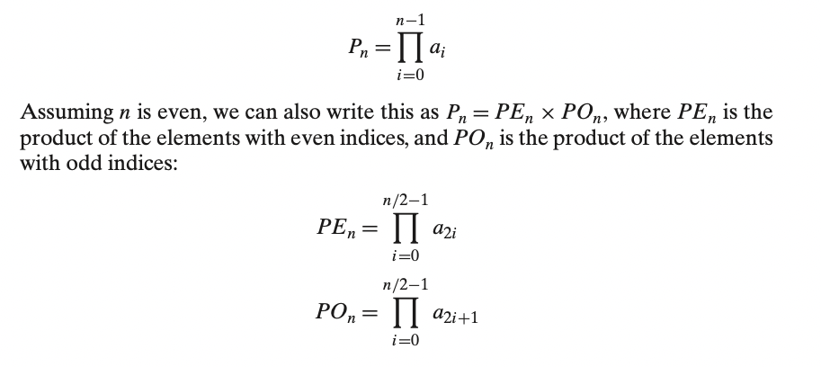
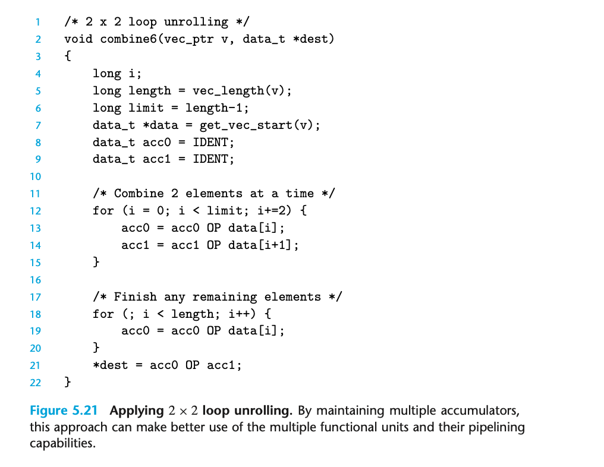
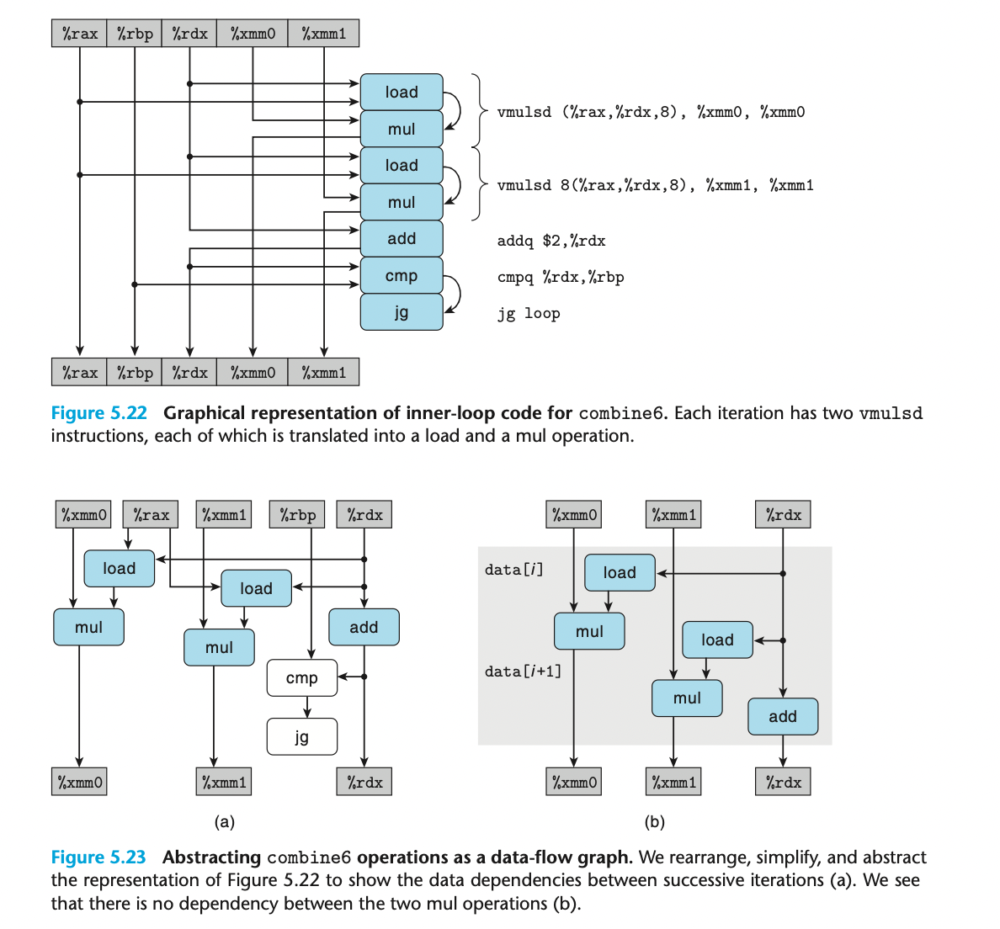

## 5.9 Enhancing Parallelism

加法和乘法操作是完全流水线化的，每个时钟周期可以开始一个新操作。 有些操作可以被多个功能单元执行。

### 5.9.1 Multiple Accumulators

乘法是满足交换律和结合律的；所以可以随意的拆分组合。

这样可以利用更多的功能单元，使得流水线满载。

在我们的例子中，一共产生了两条 critical path；每条路径中的操作数量都比原来减少了一半。

> 浮点数的乘法和加法不能满足上述结合，改变其运算顺序很有可能会产生精度问题，甚至溢出问题。大多数编译器保证不会对浮点数代码进行上述变换。

