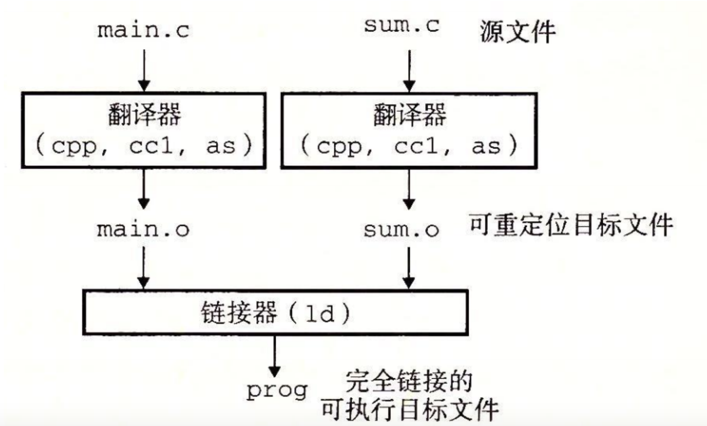

大多数编译系统提供编译器驱动程序（compiler driver），它代表用户在需要时调用语言预处理器、编译器、汇编器和链接器。比如，要用 GNU 编译系统构造示例程序，我们就要通过在 shell 中输入下列命令来调用 GCC 驱动程序：

```bash
linux> gcc -Og -o prog main.c sum.c
```

图 7-2 概括了驱动程序在将示例程序从 ASCII 码源文件翻译成可执行目标文件时的行为。（如果你想看看这些步骤，用 **-v** 选项来运行 GCC。）驱动程序首先运行 ✦C 预处理器（cpp）✦，它将 C 的源程序 main.c 翻译成一个 ASCII 码的中间文件 main.i：

```bash
cpp [other arguments] main.c /tmp/main.i
```




接下来，驱动程序运行 C 编译器（cc1），它将 main.i 翻译成一个 ASCII 汇编语言文件 main.s：

```
cc1 /tmp/main.i -Og [other arguments] -o /tmp/main.s
```

然后，驱动程序运行汇编器（as），它将 main.s 翻译成一个**可重定位目标文件**（relocatable object file）main.o：

```
as [other arguments] -o /tmp/main.o /tmp/main.s
```

驱动程序经过相同的过程生成 sum.o。最后，它运行链接器程序 ld，将 main.o 和 sum.o 以及一些必要的系统目标文件组合起来，创建一个**可执行目标文件**（executable object file）prog：

```
ld -o prog [system object files and args] /tmp/main.o /tmp/sum.o
```

要运行可执行文件 prog，我们在 Linux shell 的命令行上输入它的名字：

```
linux> ./prog
```

shell 调用操作系统中一个叫做**加载器**（loader）的函数，它将可执行文件 prog 中的代码和数据复制到内存，然后将控制转移到这个程序的开头。