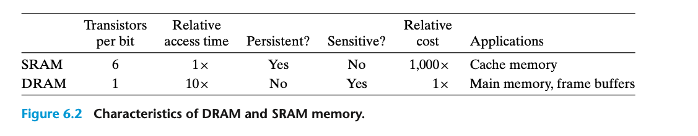

### 6.1.1 Random Access Memory

SRAM 不掉电的情况下可以一直保持状态，在有扰动的情况下也可以保持稳定。

DRAM charge on a capacitor. (电容器) 30 femtofarads 非常小。 DRAM 对扰动狠命感，射线和电压扰动都会导致数据变化。
本质上，数码摄像机本质上就是一组DRAM排列。 10 to 100 ms内，capacitor就会掉电，不过计算机普遍的周期在nanoseconds级别，所以问题不大。

系统需要定时读出数据并全部重写一遍。由于其容易受干扰的特性，有的系统还会增加一些 error-correcting code。

