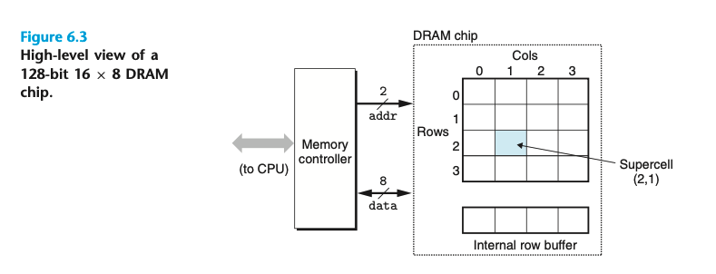
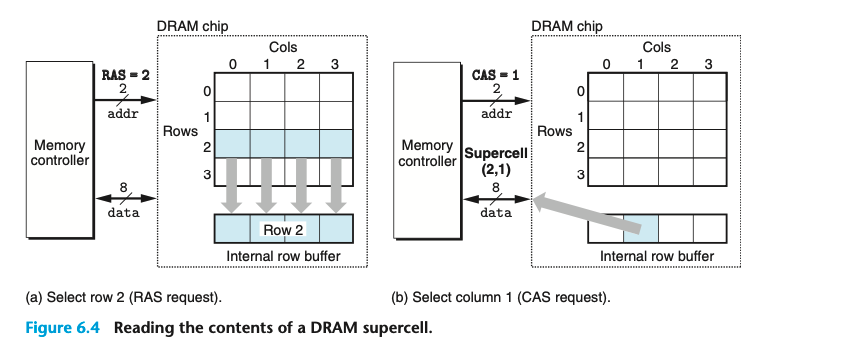
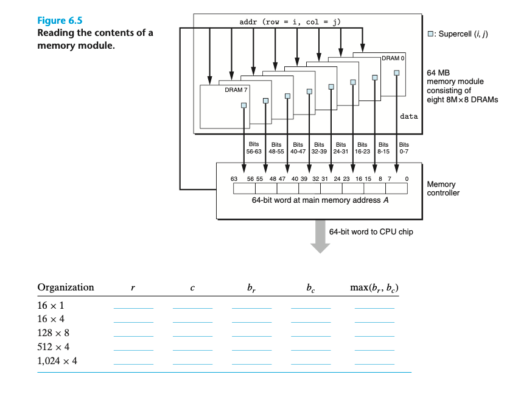

### Conventional DRAMs

DRAM 被分成 d supercells 每一个都包含 w 个 DRAM cells

一共保存 `d*w` 位信息； supercellls 是按二维 array排列的 `r*c` rc=d
所以 supercell 的地址通常写成 (i, j)

memory controller 发送地址，DRAM返回supercell的内容

> For example, to read supercell (2, 1) from the 16 × 8 DRAM in Figure 6.3, the memory controller sends row address 2, as shown in Figure 6.4(a). The DRAM responds by copying the entire contents of row 2 into an internal row buffer. Next, the memory controller sends column address 1, as shown in Figure 6.4(b). The DRAM responds by copying the 8 bits in supercell (2, 1) from the row buffer and sending them to the memory controller.

总之就是64位的内容是由多个DRAM拼接起来，用同样的地址(i,j)寻址，每个DRAM返回其中的某8位。最后拼接起来。