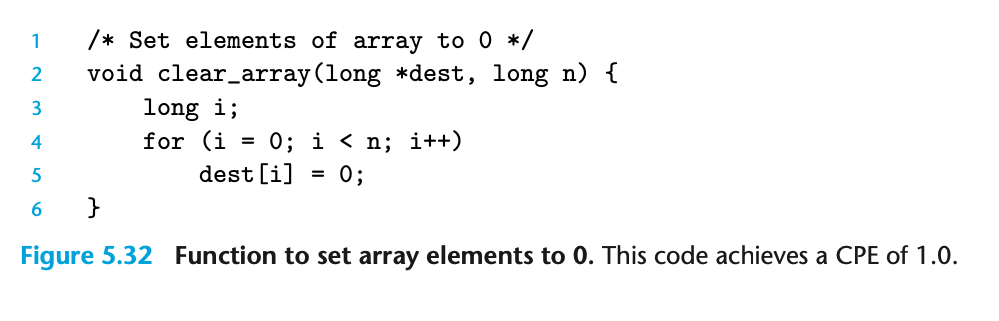
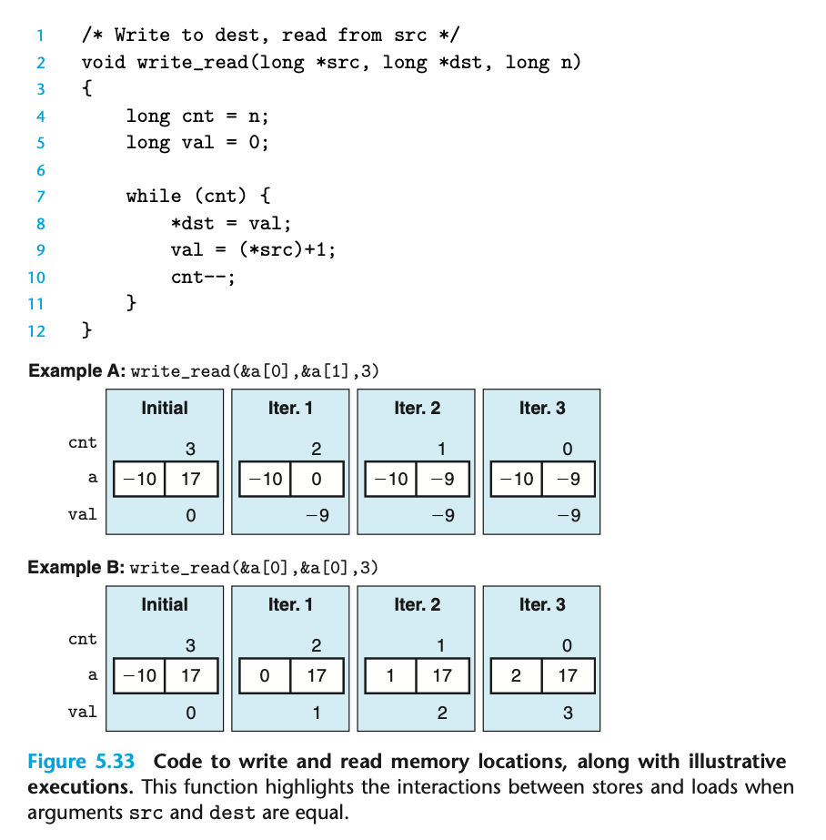
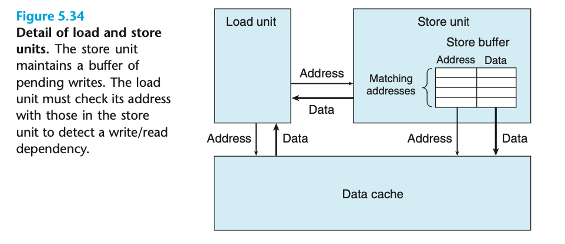
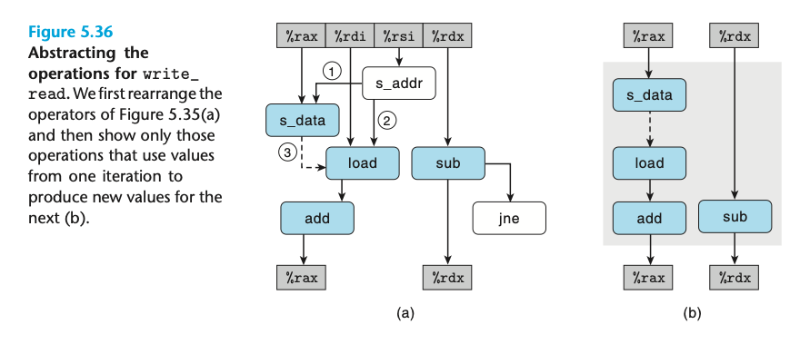

### 5.12.2 store performance

这一节我们讨论 store 的情况。

这里的 CPE = 1.0 同样是我们的最佳情况， store 操作已经 fully pipelined 了。
并且 store 操作基本上不影响寄存器，他们中的大部分是不会构成依赖关系的。 只有 load 操作可能会被 store 影响。

Example A 的 CPE 为 1.3 ； Example B 的 CPE 为 7.3。

> This example illustrates a phenomenon we will call a write/read dependency—the outcome of a memory read depends on a recent memory write.

store 存在 buffer ；load unit 需要检查自己的地址如果发现了 write/read 依赖；在 buffer 中找到了 match，就从 buffer 中读。

根据是否存在读写依赖，我们有这样的两种情况。 不存在读写依赖时，load操作无需等待写操作完成；并行度更高。