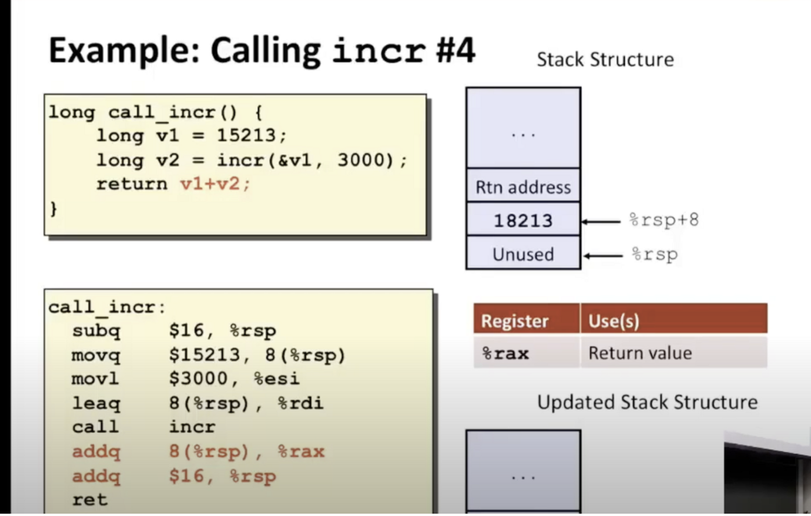

1.将3000复制到寄存器%esi（movl比movq少8位，这里只是3000且是正数，够用；当一个指令以e开头寄存器作为目的地的时候，它会将该寄存器的高32位设置为0）

2.`leaq`是汇编语言中的一条指令，用于将一个内存地址（即某个变量或标签的地址）加载到寄存器中

然后就创建好了函数的2个参数，进行函数调用

call指令将2个数字相加并将结果存储回指针，它的作用是将此内存为之设置为18213

最后的return：

我们要做的是将v1的值加到我们刚刚计算的值上，我们刚刚计算的值是v2

最后2段的意思是：

`addq 8(%rsp),%rax`：

执行这句汇编指令后，程序会从 `%rsp`寄存器中取出一个地址（即 `%rsp + 8`），访问该地址中存储的 8 个字节的值，并将该值加到 `%rax`寄存器中

`addq $16,%rsp` ：

执行这句汇编指令后，栈顶指针 `%rsp`的值会加上 16 个字节的偏移量，栈顶位置向下移动 16 个字节，释放了这段空间。通常情况下，执行这句指令是为了在栈上分配空间，例如，为局部变量、函数参数、返回地址等留出空间