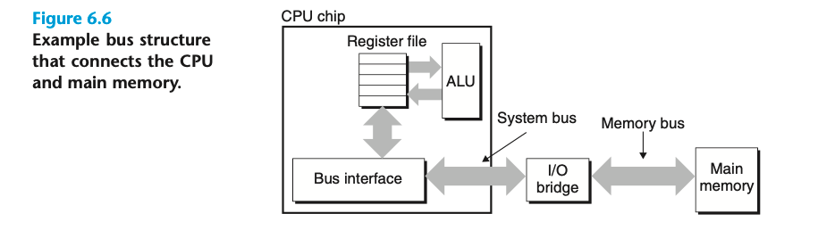
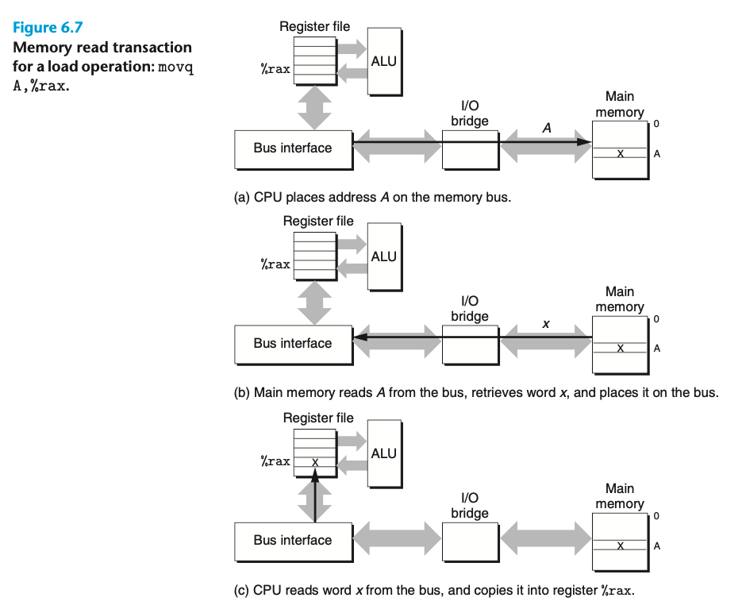

### Nonvolatile Memory

ROMS (read-only memories) 这是一个有历史包袱的名称 ROMs其实有可写的版本；通常可重复写的次数有限

PROM (programmable ROM) 可被编程一次

EPROM 可被编写1000次

Flash memory 就是基于 EEPROMs 实现的非易失存储； SSD 是一种 flash-based disk drive

### Accessing Main Memory
> Data flows back and forth between the processor and the DRAM main memory over shared electrical conduits called buses.

> A read transaction transfers data from the main memory to the CPU. A write transaction transfers data from the CPU to the main memory.

总线上传递 地址、数据、控制信号

