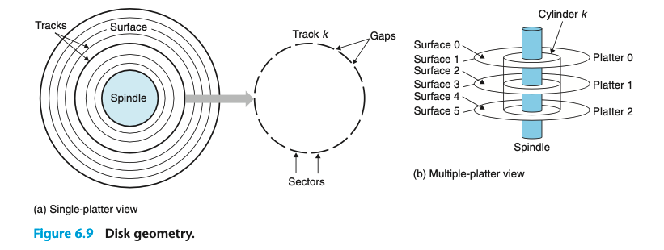
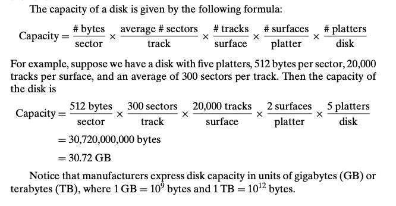

### 6.1.2 Disk Storage

磁盘读写是毫秒级的 比DRAM慢十万倍 比SRAM慢百万倍

### Disk Geometry
盘状结构 通常每秒5400-15000转 RPM(revolutions per minute)

rotating disks 和 solid state disks 运作机制不同，我们主要介绍的是 rotating disks

> Recording density (bits/in). The number of bits that can be squeezed into a 1- inch segment of a track.
> Track density (tracks/in). The number of tracks that can be squeezed into a 1-inch segment of the radius extending from the center of the platter.
> Areal density (bits/in2). The product of the recording density and the track density.

