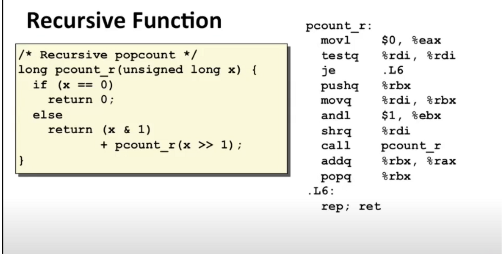

参数为0就是0，否则去最低有效位（0或者1），这个结果加上剩余数字的统计结果就是最终结果，剩余数字可通过原来数字右移一位得到

这里参数都是unsigned，所以右移运算都是逻辑右移，不是算术右移

1.x==0,将寄存器的返回值设置为0（%eax），然后测试x是否为0，je表示测试结果为0（相等）就跳转，我们将跳到函数末尾并执行返回指令

2.`pushq %rbx` 跟踪x的最低有效比特位，暂时将它放在栈上，以便返回时可以恢复成原来的值。

%rdi中保存了移位后的值。当pcount_r返回时，可以假设%rax保存了递归调用的返回值，%rbx将恢复到原来的状态，%rbx就在调用之前我把它设置为这个右移后的值

3.当我返回时，我可以假设%rbx中存储了原始参数x的最低有效位，而%rax保存的是递归结果，所以我可以将这两个数字加在一起，最后的返回值即为正确计算的结果，然后最后是弹出%rbx来恢复它的值，然后返回

所有函数都用了同一个通用约定，什么寄存器可以使用，如何使用寄存器，如果一些寄存器在被使用后必须被恢复，还可能参与其他工作，我们就需要让它能够恢复到之前的状态，如果你使用寄存器%rbp作为栈指针，即指向一个帧的开头，同时，假设你有一个需要基指针的函数，因为我们提过，如果一个函数在内部需要分配一些空间，现在想象一下还要有其他一些代码构成深度递归调用，如果他们改变了，如果他们处于某种原因使用了%rbp，他们会保证将其恢复，现在这个函数都将得到具有可靠值的%rbp

栈原则是递归调用可行的原因所在，因此，每次函数调用都有一个帧栈，这个思想意味着，我可以调用函数，调用函数，调用函数，直到永久…当我深层递归时，我仍然拥有调用当前函数的其他未完成调用相关联的数据，所以必然有一个地方，用于存储与函数的一个特定实例相关联的信息

我们看到寄存器保存约定确保了函数之间避免出现相互摧毁彼此数据的情况，我们有义务保存并正确恢复他，任何被调用的函数都有义务进行保存和恢复，然后这种栈的概念与过程调用和返回的方式相匹配