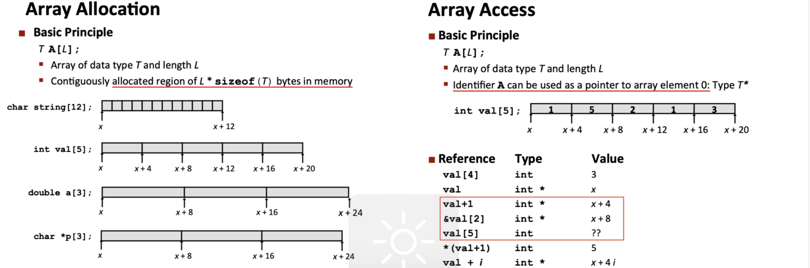
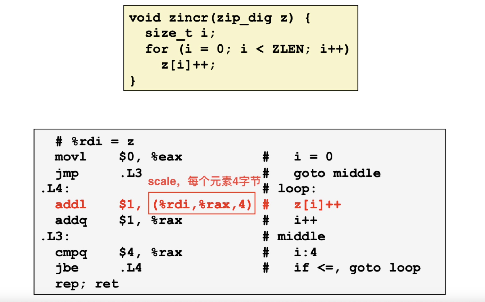
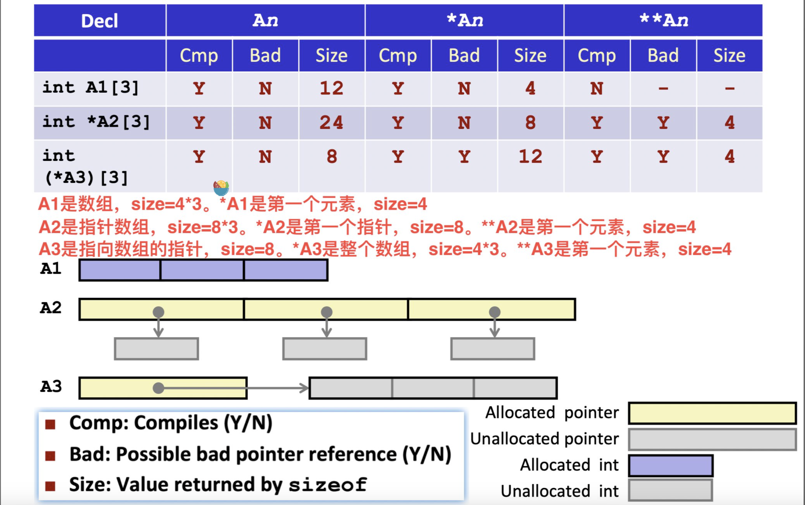
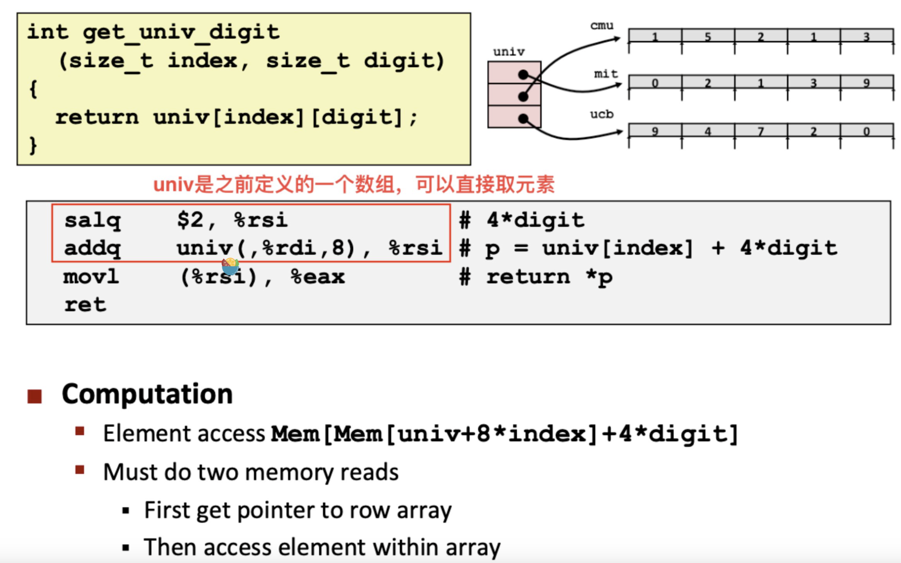

一些数据的存储和读取：
\1. Array、Structure、Array和Structure的组合
\2. Structure的对齐
\3. 浮点数（XMM寄存器）

## Arrays

内存中的连续存储区域

**Array Loop Example**

**Understanding Pointers & Arrays**

**Element Access in Multi-Level Array**

