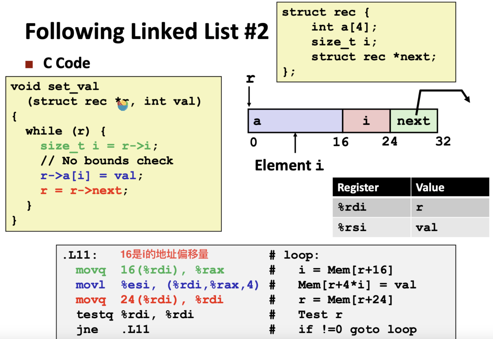

## Structures

结构是一些数据类型的集合，编译器会为每个字段分配空间并计算好地址偏移量。取值的时候根据偏移量来取字段

**Structure Representation**

**Following Linked List**

**Structures & Alignment**

当structure中有一个k字节的字段，编译器通常更喜欢起始地址是k的倍数。所以引入了一个”对齐“的概念。在给structure分配空间时，编译器会插入一些空白的字节，来保持对齐。

大多数硬件不是一次性取一个字节，而是大约64个字节。如果没有一个对齐的地址，一个特定的数据跨越了两块之间的边界。这会让硬件甚至操作系统采取一些额外的步骤来处理。对齐的数据可以让硬件处理起来更有效率。

**Satisfying Alignment with Structures**

**Arrays of Structures**

**Saving Space**

把最大的字段放到最前面

