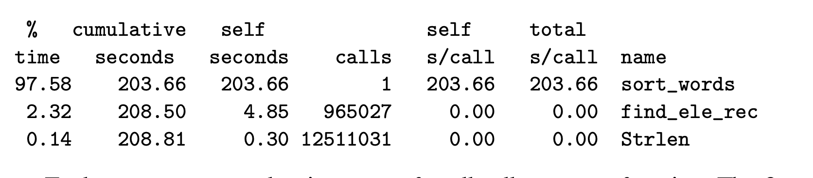
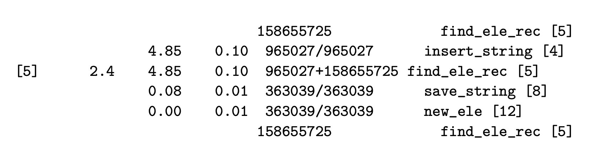

## 5.14 Identifying and Eliminating Performance Bottlenecks

本章介绍 code profilers 这样的分析工具，帮助我们了解程序运行的性能数据，从而进行程序的优化。

### 5.14.1 Program Profiling

统计了函数的调用时间，包括百分比、调用次数和累积时间等信息。

统计了调用的历史，包括调用当前函数的函数信息和被调用的函数信息。

> For example, the function find_ele_rec is a recursive procedure that scans the linked list for a hash bucket looking for a particular string. For this function, comparing the number of recursive calls with the number of top-level calls provides statistical information about the lengths of the traversals through these lists. Given that their ratio is 164.4:1, we can infer that the program scanned an average of around 164 elements each time.

时间统计可能是不准确的，底层是依赖于统计函数被系统中断的次数。小于1s的函数时间仅供参考。
> operating system causes the program to be interrupted at some regular time interval δ