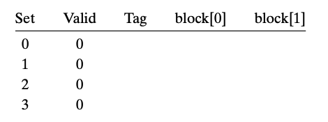
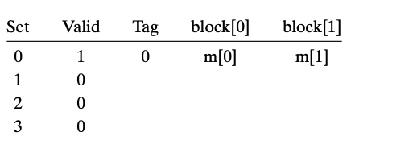
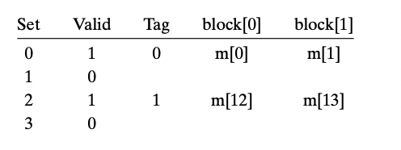
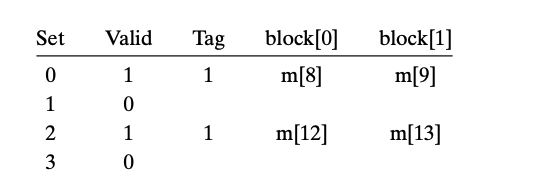
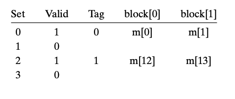

- 我们一起来模拟一下CPU执行一系列读操作时缓存的行为  
	- 
	- read 0 miss  
		- 
	- read 1 hit  
	- read 13 miss  
		- 
	- read 8 miss  
		- tags not match  
		- 
	- read 0 miss  
		- been replaced; tags not match  
		- 