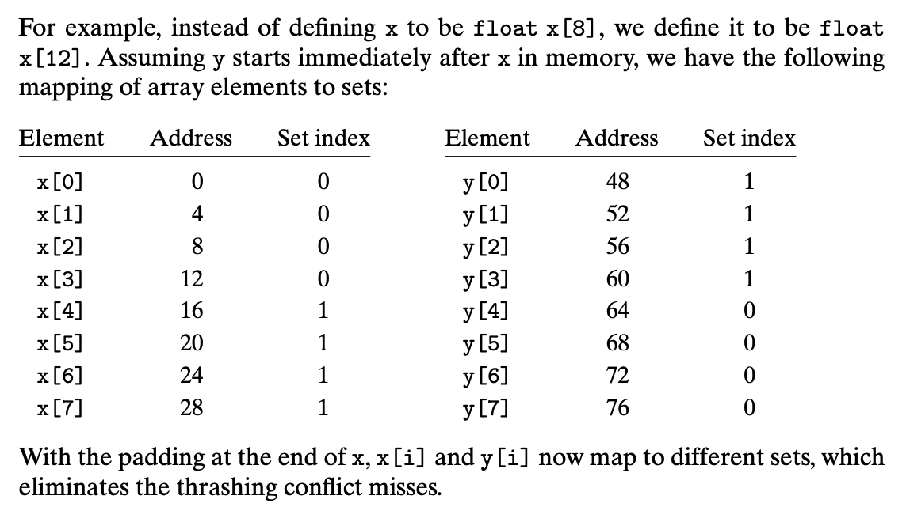

### Conflict Misses in Direct-Mapped Caches
conflict miss 会导致迷惑的性能问题

> Conflict misses in direct-mapped caches typically occur when programs access arrays whose sizes are a power of 2.

```c
float dotprod(float x[8], float y[8]) {
    float sum = 0.0;
    int i;

    for (i = 0; i < 8; i++)
        sum += x[i] * y[i];
    return sum;
}
```

这个程序由于有良好的时空局部性，我们预期应该有良好的 cache hits；但事实上不一定。


如果要缓存的类型和block正好满足某种关系时，就会出现上述这种情况。x和y来回在同一个cache set互相覆盖。
> The term thrashing describes any situation where a cache is repeatedly loading and evicting the same sets of cache blocks.

这个问题在真实世界是常见的。

一种常见简单的解决方案就是在每个属组后面做一些padding。
