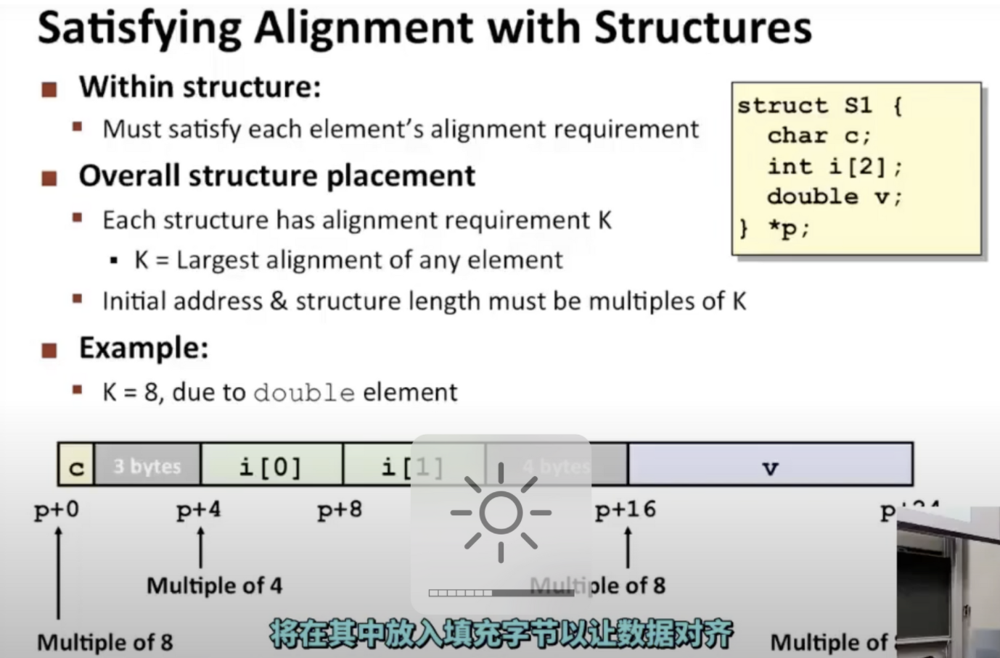
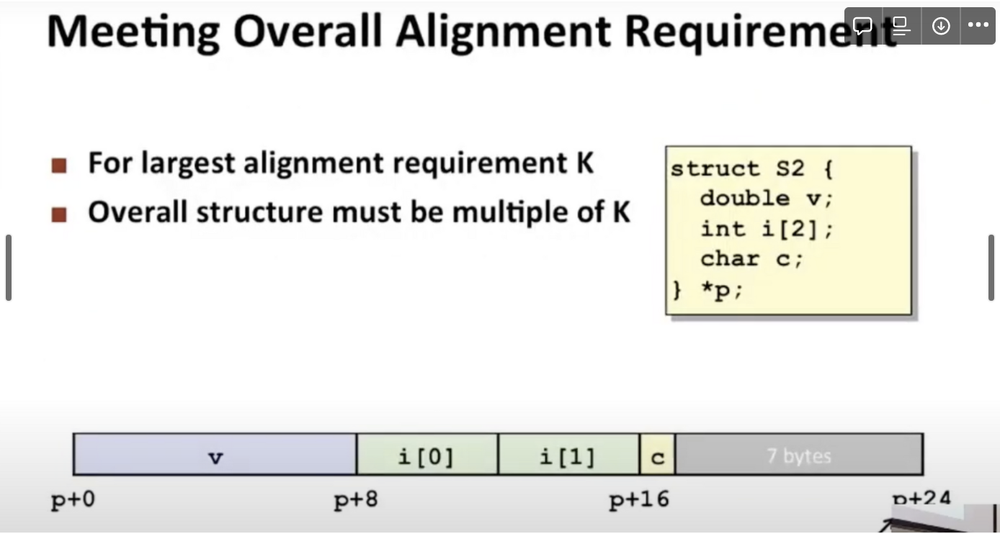
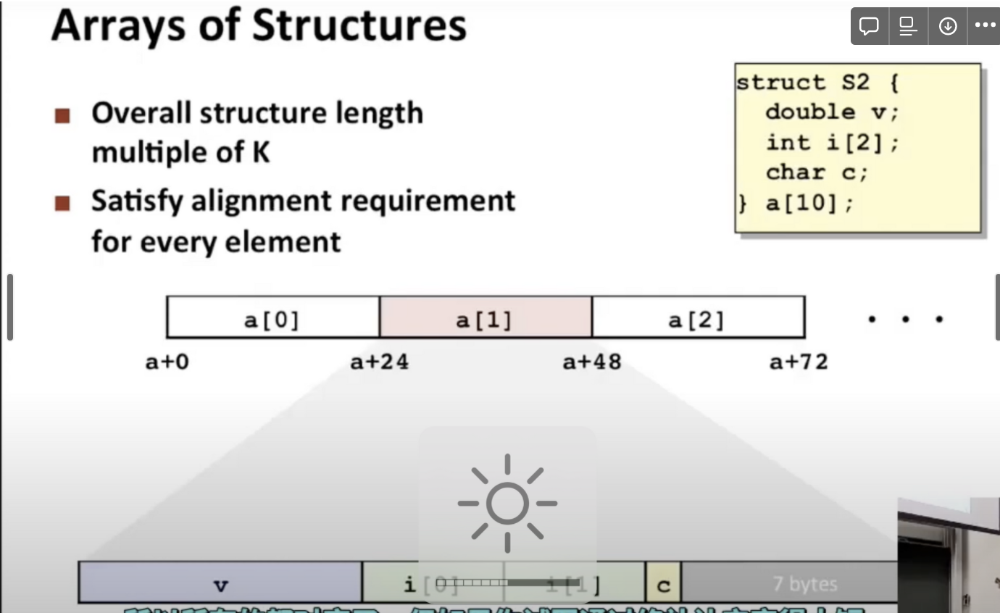
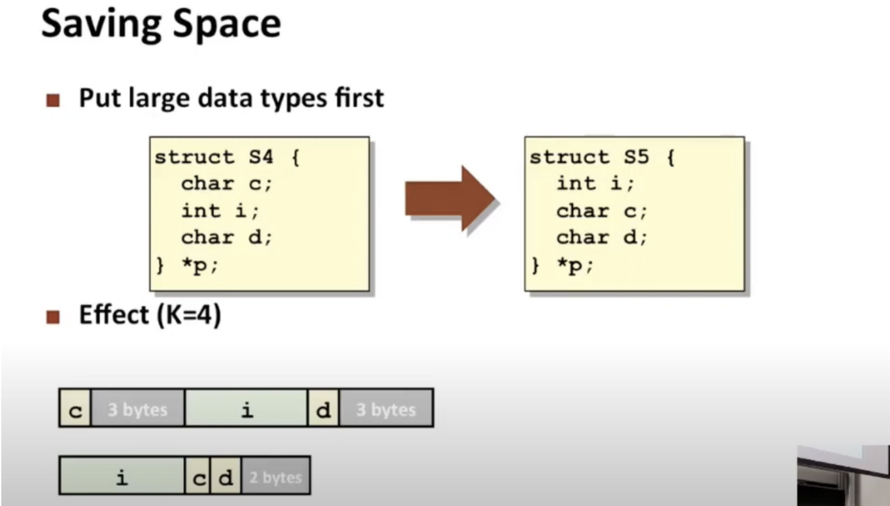

对齐的例子

每个结构实际的对齐要求取决于，什么是最坏对齐情况，即任何元素的最大对齐要求，下面的例子包含一个大小为4的浮点数v，因此这将是4字节对齐

最小化内容操作：在结构体声明中把内存大的往前放

编译器需要进行字节对齐的原因：

1. 实现数据结构对齐:要求结构体中各个字段的地址必须是该字段类型大小的整数倍。这是为了方便对应类型的寻址运算。如果不对齐,则寻址时需要考虑跨字段边界的情况,会增加代码复杂度。
2. 利用存储空间:如果不对齐,结构体中各个字段之间会出现不能用的空洞字节,浪费存储空间。通过对齐可以减少空洞字节,提高空间利用率。
3. 优化数据访问:当结构体放在内存中时,如果各字段对齐,则相同类型的字段可以连续放置在内存中。这有利于通过串行读写提高访问效率。如果不对齐,则需要不连续地读写多个内存块,降低效率。
4. 使得数据在不同机器上有一致的内存布局:不同的机器,如大端机和小端机,内存字节的存储顺序不同。通过要求字节对齐,可以使同一数据结构在不同机器上有相同的内存布局,方便数据交换和通信。
5. 优化指令流水线:如果连续的内存地址对应的数据类型相同,可以利用指令流水线提高运算效率。如果地址不连续,流水线会因需要处理跨地址的情况而减慢。

所以,总的来说,编译器要求进行字节对齐的主要目的是为了**优化数据的存储与访问,方便编程并提高执行效率。**它使计算机系统可以有更高的性能表现,这也是编译优化的重要手段之一。