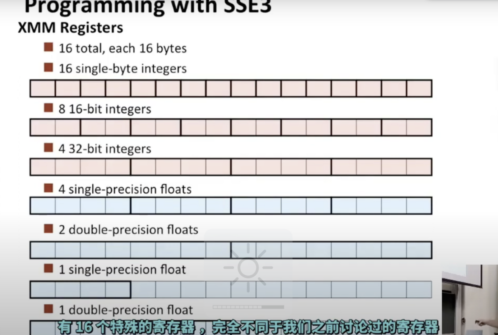
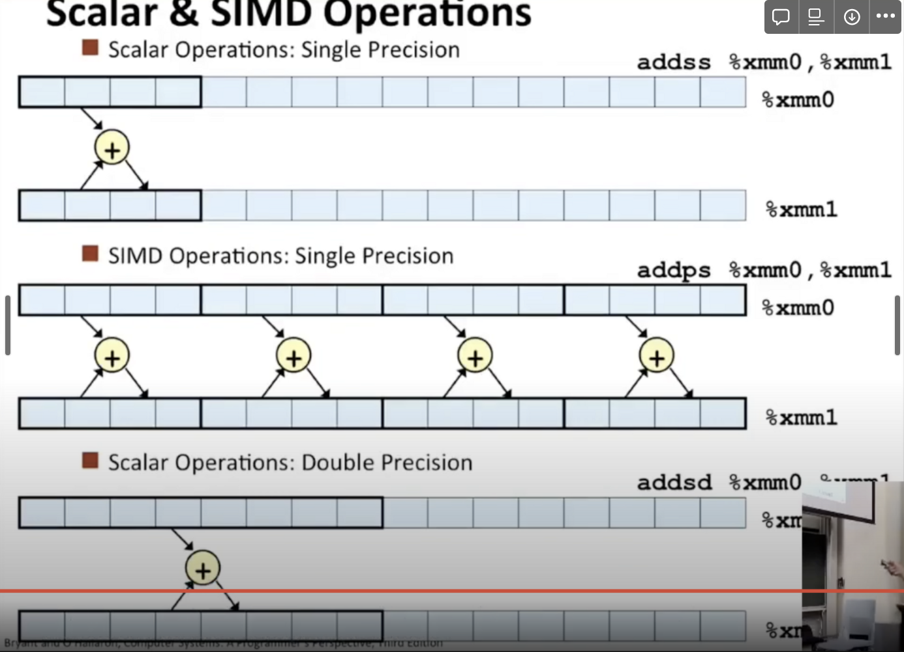
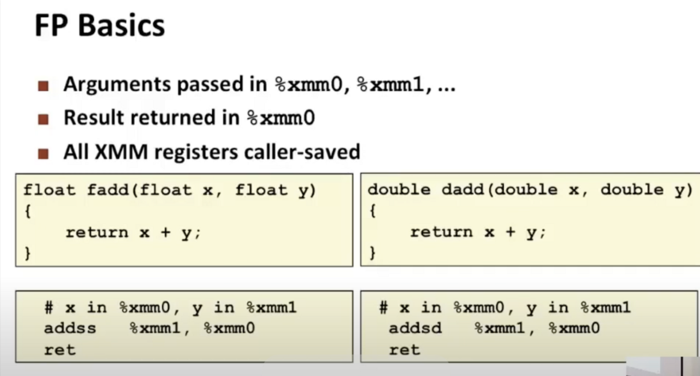
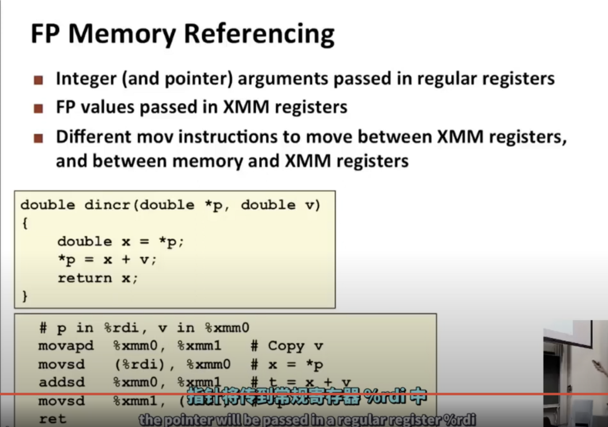

## 浮点数

一类SSE的指令，替代SIMD执行SIMD要执行的部分

举个栗子

有一条写成addss的指令，有点像addq指令，但是它是成组运算的，单个指令addps，p指pack（一组），就能同时对4个不同的数进行加法运算

具体应用：

这些寄存器的命名非常符合逻辑

如果既有指针（整数）的运算符，也有浮点数的运算符，指针将传到常规寄存器%rdi中，双精度浮点数将传入%xmm0中

