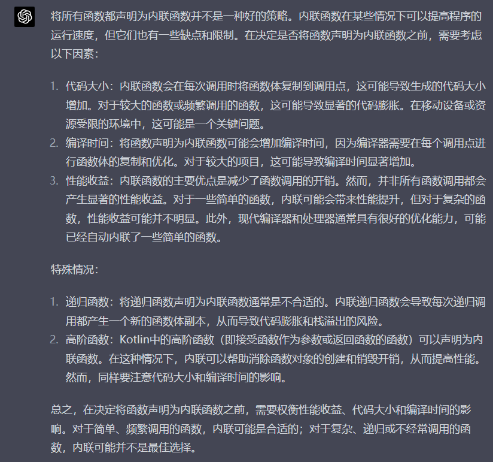

### 第5章 优化程序性能

编写高效程序需要做到以下几点：

1.选择适当的算法和数据结构

2.写出编译器能有效优化的代码

第一点相对来说是比较容易做到的，但第二点就很不容易。当然，对于一些任务，还可以通过第三点优化。

3.将一个任务分成多个部分，使得其可以进行并行计算。

程序优化也可以分为两步，一步是消除冗余代码，第二部是利用指令级并行的能力，同时执行多条指令。

其实具体来说，代码优化是一个很细致的工作，不太可能掌握了一个准则就可以直接去优化代码了。

但有个问题，现在的代码（比如Java、Python）距离汇编都有点远，不知道本章学习的知识是否能够有效地应用于这些环节之中。

#### 5.1 优化编译器的能力和局限性

(1)内存别名使用 这里的例子看P343就可，很好理解

P344-P345页中间提到的内联函数优化的行为，对C语言（包括C++）学习者来说并不陌生，几乎所有的教程都会提到内联函数对性能提升的重要性，但说实话，这个的度感觉不是特别好把握，至少我个人对内联函数的适用条件还不是很清晰（能加的都加上也算一种策略，但不知道会不会有什么问题，最直观的，内联函数算是一种用存储换性能的策略，大量使用内联函数会使得程序过大）

这里我们可以看看ChatGPT怎么说：

#### 5.2 表示程序性能

这里引入每元素的周期数（Cycles Per Element，CPE）作为表示程序性能并指导改进代码的方法。

p346 To be continued