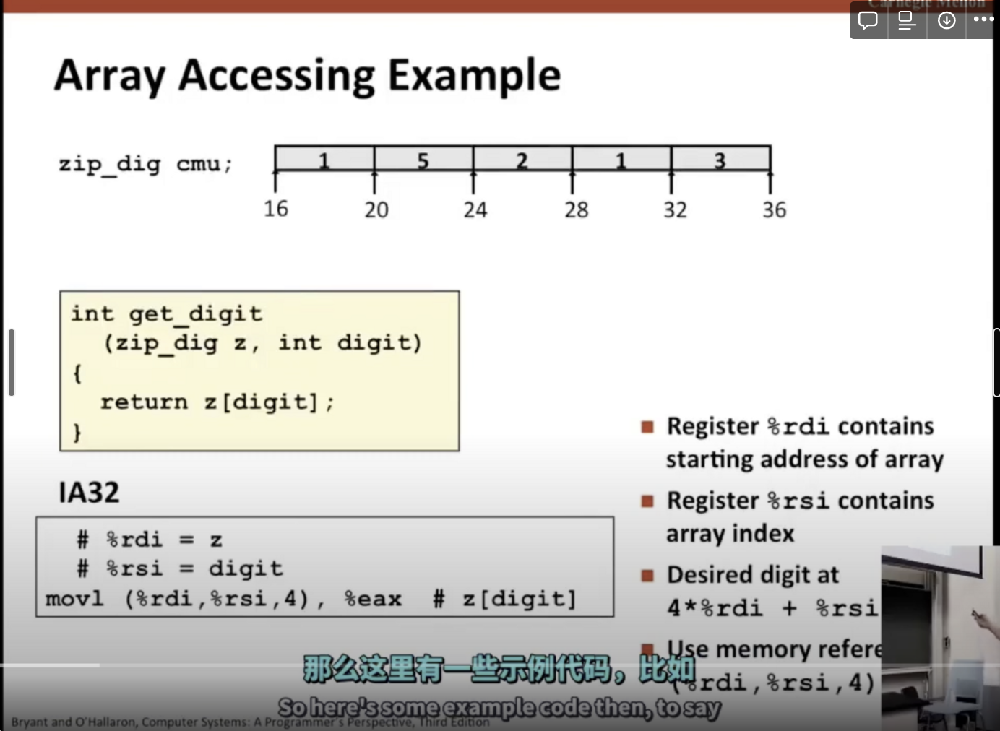
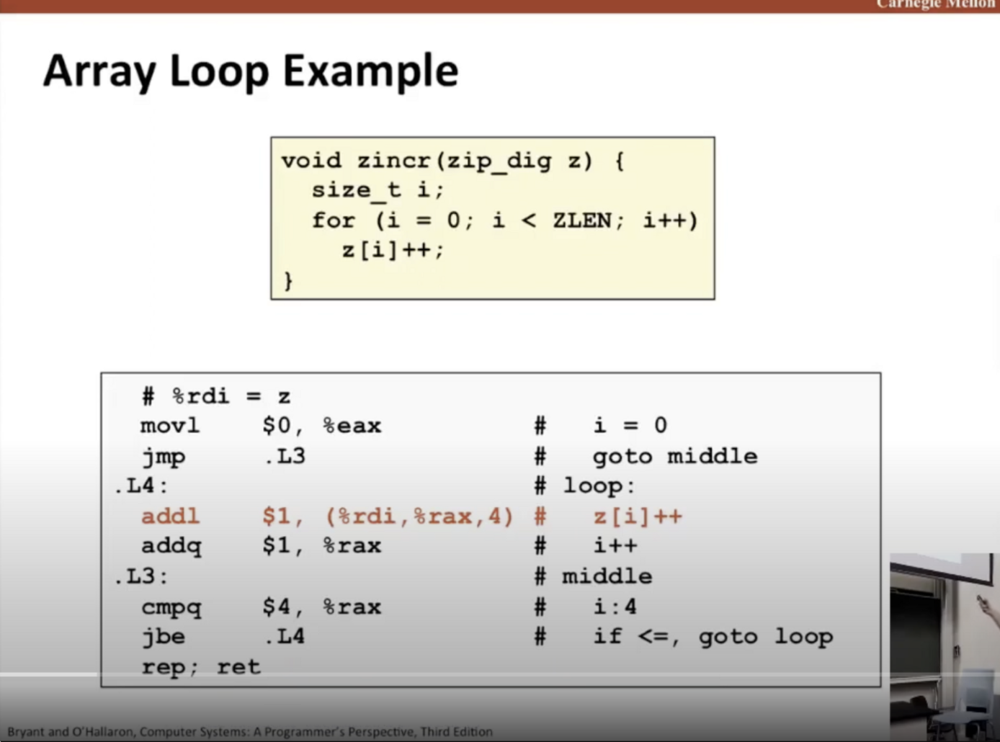

数组访问的实际例子

数组遍历的例子

> 在汇编语言中，`jbe` 是一个条件分支指令，用于在无符号比较时跳转到另一段代码的位置。
>
> 具体来说，`jbe` 操作码是 `0x76`，它的含义是 "Jump if Below or Equal (无符号比较跳转到另一段代码)"。当执行该指令时，将检查执行结果，并根据结果决定是否跳转到指定的内存地址处继续执行。
>
> 如果该指令所在的前一条指令执行结果的结果小于或等于零，则会发生跳转，程序将在指定的内存地址处继续执行。否则，程序将继续执行该指令之后的指令。
>
> 因此，`jbe` 操作码通常与条件寄存器结合使用，以实现更复杂的逻辑控制和分支跳转。