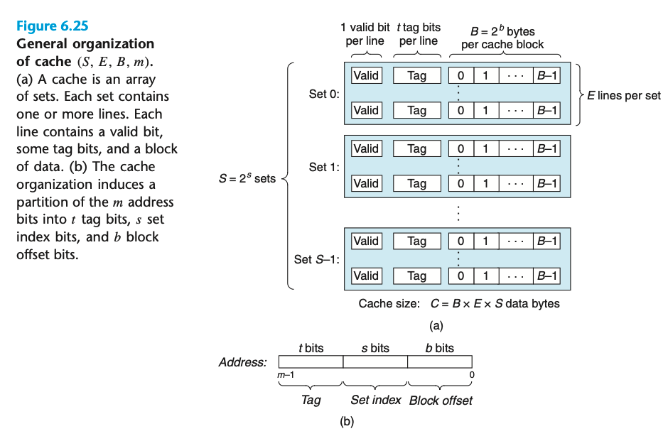

- # 6.4 Cache Memories  
	- 早期计算机系统中 memory hierarchies 只包括三层：  
		- CPU register, main memory, disk storage  
	- 由于CPU和主存的gap变大 系统设计者被迫加入了更多的缓存层 在CPU register file 和 main memory 之间加了一层很小的 SRAM cache memory（L1） 随后又加了 L2 L3  
		- L1 4 clock cycles  
		- L2 10 clock cycles  
		- L3 50 clock cycles  
	- 
	- ## 6.4.1 Generic Cache Memory Organization  
		- 
		- Capacity: C = S x E x B  