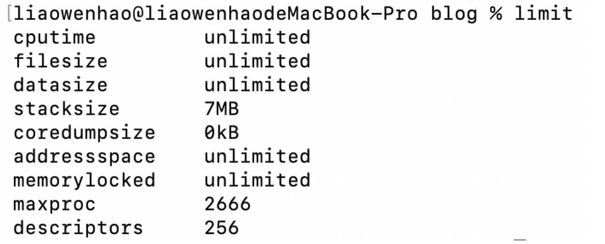
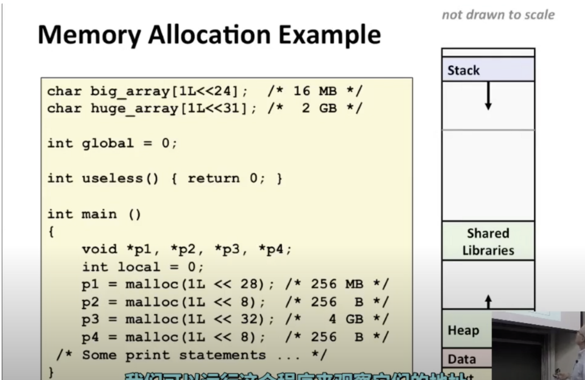
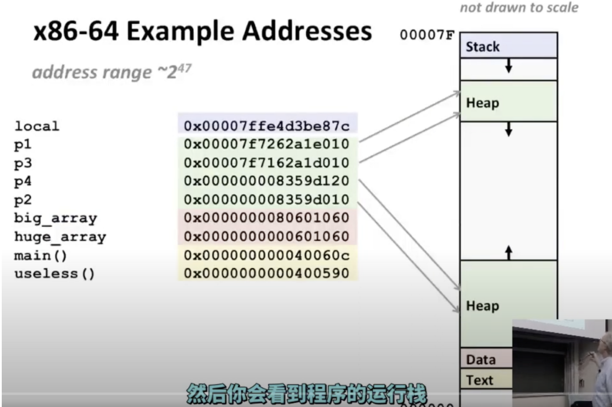
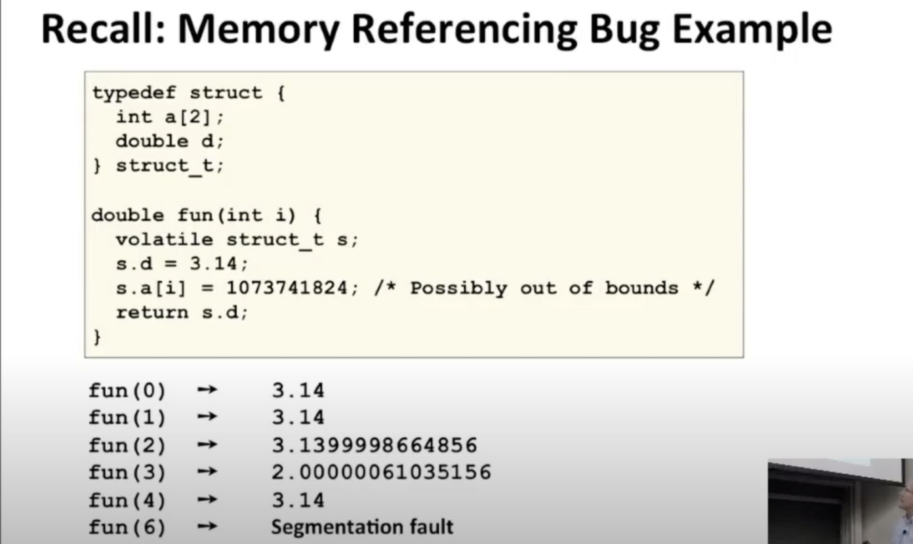

## Memory Layout

从概念来说，【内存】就是一个很大的字节数组，其实就是虚拟内存

它的底层实现，是对一系列不同存储类型的复杂管理，从磁盘存储到固态存储到所谓的DRAM

x86-64机器上的地址在名义上有64位，64位机器支持的内存大约是16*10*18字节

现在64位机器会限制只使用47位的地址（差不多256TB）

在linux中，整个地址空间的顶部是放置栈的地方，在常用的系统中，栈的大小是8MB，可以使用limit指令看栈大小

往下更下方的地址是你的程序存放代码的地方，它来自于可执行文件，这块区域被称为文本段

再往下是数据区，首先有一个数据段是在数据区中用来存放程序开始时分配的数据的，你声明的全局变量都在这个数据段中

堆用来存放通过malloc或相关的函数申请的变量，malloc申请的空间要释放，不然他会一直往高处增加

还有一个地方也是存放代码的，不过它存储的是类似printf和malloc这样的库函数，库代码被存储在磁盘上，当程序开始之初会把他们加载到你的程序当中，称之为【动态加载】

一个程序例子

## Buffer Overflow

一些库函数也会出现这样的情况

gets()

strcpy()

strcat()

