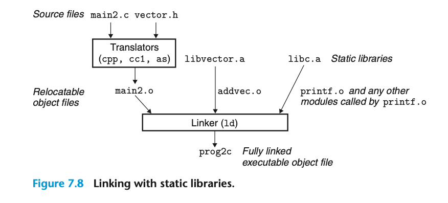

## 7.6.2 Linking with Static Libraries
截至目前为止，我们都假设链接器读取一组 relocatable object files 然后链接成一个可执行文件；但实际上，编译器还提供一种机制，可以把相关联的模块打包成一个 static library；这个也可以作为链接器的输入。 链接器只会从中拷贝出被应用程序所应用的对象模块。
不用静态库的话，我们有一些办法可以为用户提供标准函数：
1. 直接在编译器中实现对应的函数 - 但这样对编译器的实现带来很大的成本
2. 将所有的C函数放入一个可重定位对象模块 - 巨大的磁盘浪费；更糟的是，每个运行的程序现在都会在内存中包含自己的标准函数副本，这将极大地浪费内存。另一个大的缺点是，对任何一个标准函数的任何小改动，都需要库开发人员重新编译整个源文件，这是一个耗时的操作，会增加标准函数的开发和维护的复杂性。
3. 为每个标准函数创建单独的可重定位文件 - 可以通过为每个标准函数创建单独的可重定位文件，并将它们存储在一个众所周知的目录中来解决一些问题。然而，这种方法要求应用程序员显式地将适当的对象模块链接到他们的可执行文件中，这个过程容易出错且耗时
因此我们才有了静态库，提供了一种方便的方式将常用的函数逻辑打包成库，并且库的代码和数据与目标程序完全独立。
`linux> gcc main.c /usr/lib/libm.a /usr/lib/libc.a`
.a 后缀表示 archive；是 linux 系统对静态库文件存储的格式

静态库加载.o文件是按需加载的，只有被引用的模块才会从.a文件中被加载。