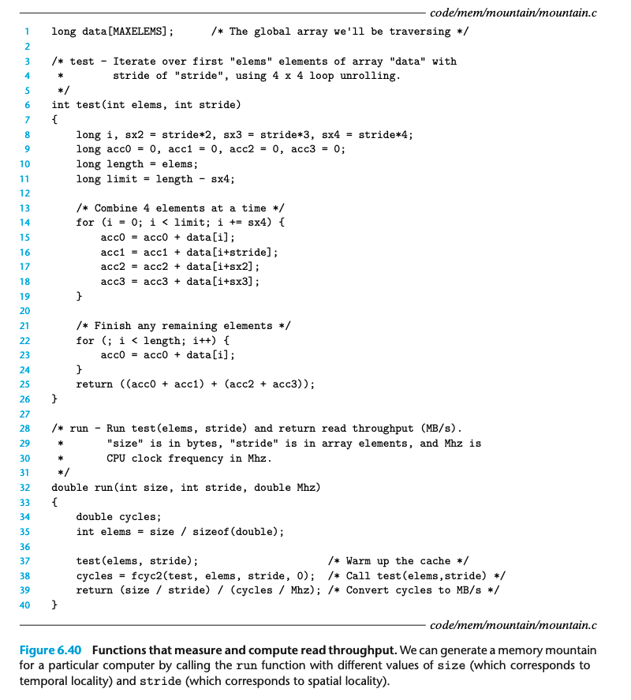
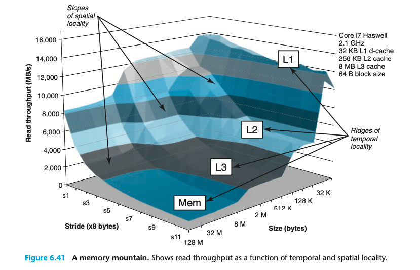
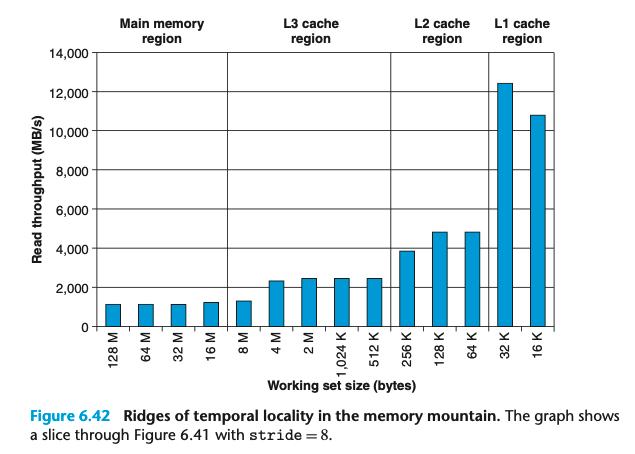
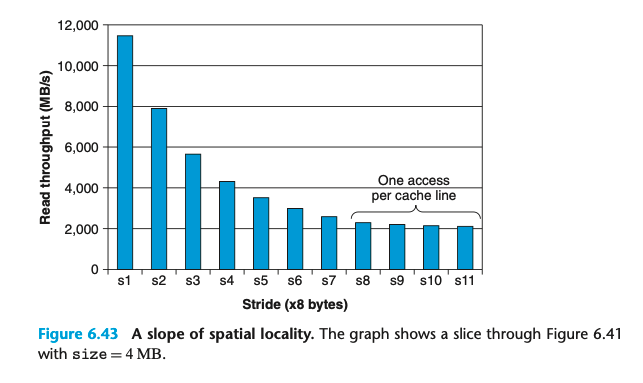

- # 6.6 Putting It Together: The Impact of Caches on Program Performance  
	- 本节讨论 Caches 对在真实机器上运行的程序的性能影响  
	- ## 6.6.1 The Memory Mountain  
		- read throughput / read bandwidth: 程序从内存系统中读取数据的速率  
		- 
		- 通过上面的代码 调整 size 和 stride 我们可以生成一个 memory mountain ； 展示了不同的时空局部性下的 read throughput  
		- 
		- stride = 1 的时候 整体是比较平缓的 这是因为预取在发挥作用  
		- L1 L2 L3 的size导致了山脊的存在  
			- 
		- slope of spatial locality  
			- 
		-  