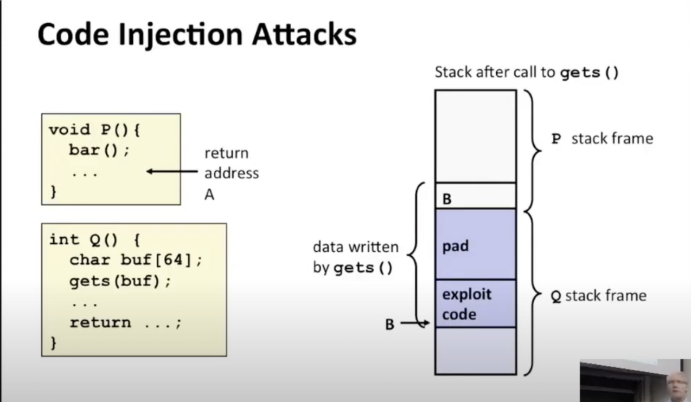

注入攻击：

常见的模式是，我可以使用我想要的字符填充gets或其他具有复制功能的函数的缓冲区，有些字节可以被编码为可执行的代码，然后可能还需要添加一些没有意义的填充字符来获取返回指针，在这里它被称为数字B，它代表了栈的某个位置，在这里它被称为数字B，它代表了栈的某个位置，B是缓冲区的起始地址，它刚好又是注入代码的地址，因此程序将会返回到这里，它本来应该返回P中调用它的地方，它本应该返回P，这个返回值被存储到这里，但是现在我使用了这个缓冲区覆盖了这个地址，所以程序会跳到bar函数

