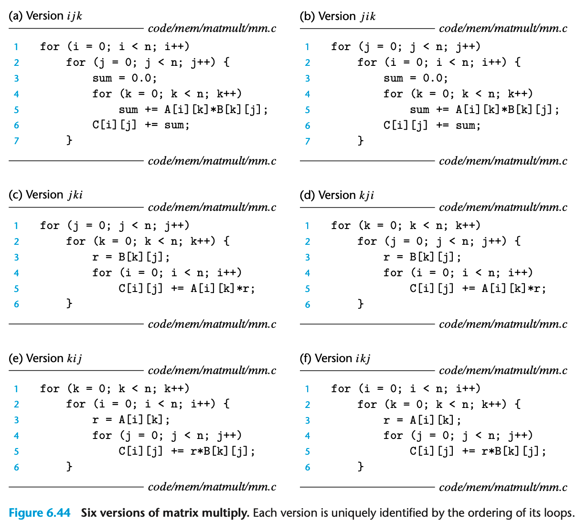
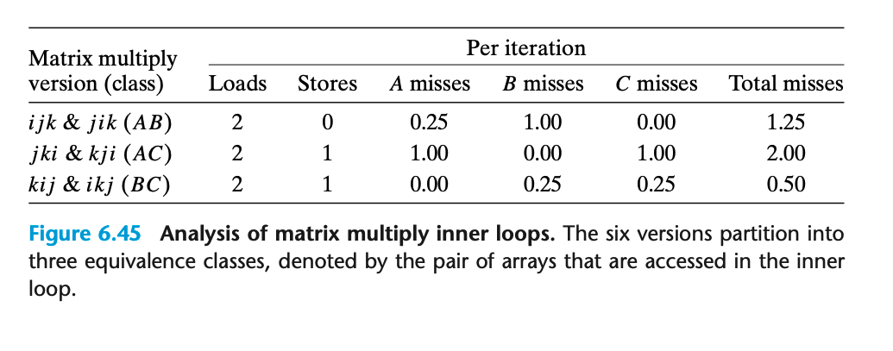

- ## 6.6.2 Rearranging Loops to Increase Spatial Locality  
	- 考虑矩阵乘法的例子  
	-  
	-  
$$ \left[\begin{array}{ccc} c11 & c12 \\ c21 & c22 \\ \end{array} \right] = \left[\begin{array}{ccc} a11 & a12 \\ a21 & a22 \\ \end{array} \right]  \left[\begin{array}{ccc} b11 & b12 \\ b21 & b22 \\ \end{array} \right]$$ 

- 通常在计算机中通过采用三层循环的方式实现矩阵乘法；但循环顺序不同，虽然时间复杂度是一样的，效率可能也会差距很大；如果仔细分析一下，就会发现主要差异来源于局部性不同  
	- 为了更好的分析，我们做一些假设：  
		- 矩阵由 double 类型构成  
		- single cache with a 32-byte block size  
		- 数组大小不超过 L1 cache 大小  
		- compiler 将本地变量都存在了registers 因此访问这些变量不需要额外的load和store指令  
	- 
	- 
		- 0.25 怎么计算出来的？ 如果前述假设成立且stride是1，每次cache可以缓存4个元素，命中率为1/4。 而如果 stride 是 n，由于n很大，每次缓存都不会命中  
	- BC routine 缓存命中率最高；但是相比于AB routine，需要一次额外的store （因为C[i][j]不是内层循环一次即可求值的，而是要跨越多次内层循环）  
		- 整体来说还是BC性能更好  
	- 性能最差的实现比最快的实现可以差40倍以上  
	-  
		-  