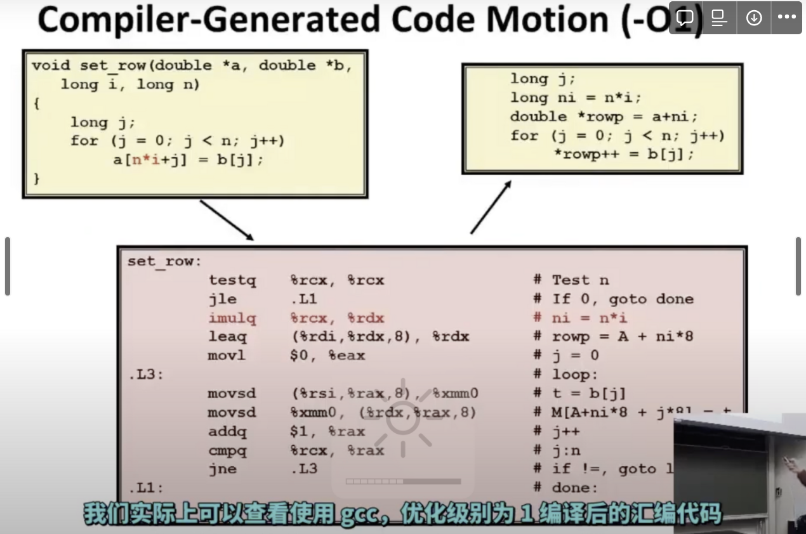
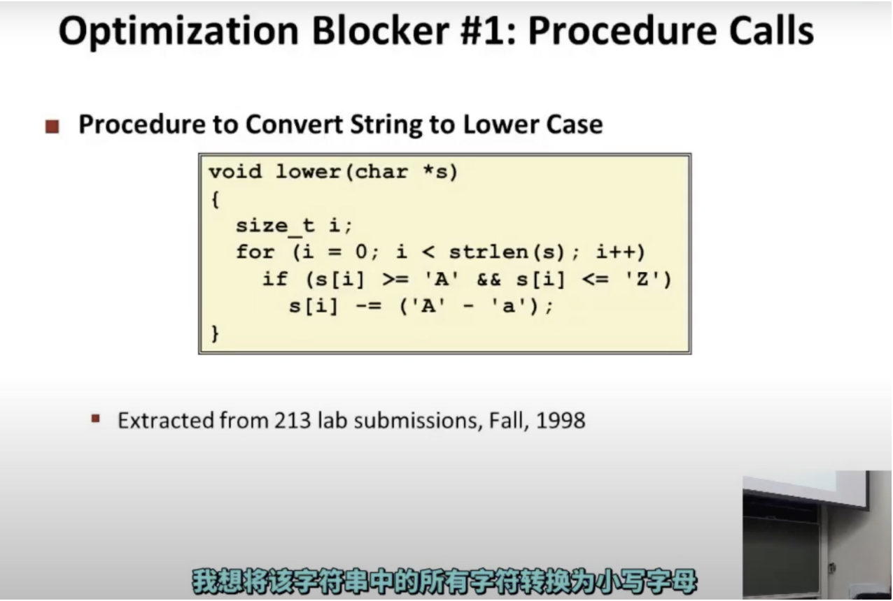
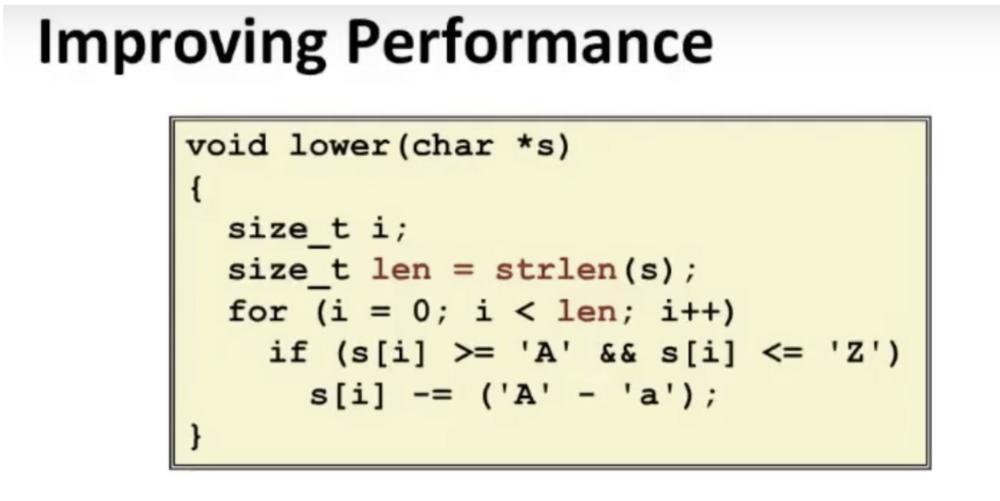

主题是：如何让程序运行地更快

1.去掉程序中不必要的工作

2.写出编译器友好的代码

一个例子：

c语言的一种编程风格：一个二位数组，程序员可以将第i行第j列转换成一维数组的位置，这个通常也会抽象出一个函数

二维数组的每一行设置为数组b的值

编译器的优化点

1.乘法抽到外面了

2.改成了指针风格

for循环有3个部分，第一部分初始化执行一次，后面2个部分每次都会执行，所以在这里是复杂度是二次函数

下面代码能够将其优化到线性复杂度：

为什么编译器不会主动对其做优化？

1.这里的操作修改了字符串，并且每次都在调用strlen函数，编译器必须非常小心地分析，知道字符串即使改变了，长度也不会变化

2.编译器不能确定哪个版本的strlen实际上将被使用