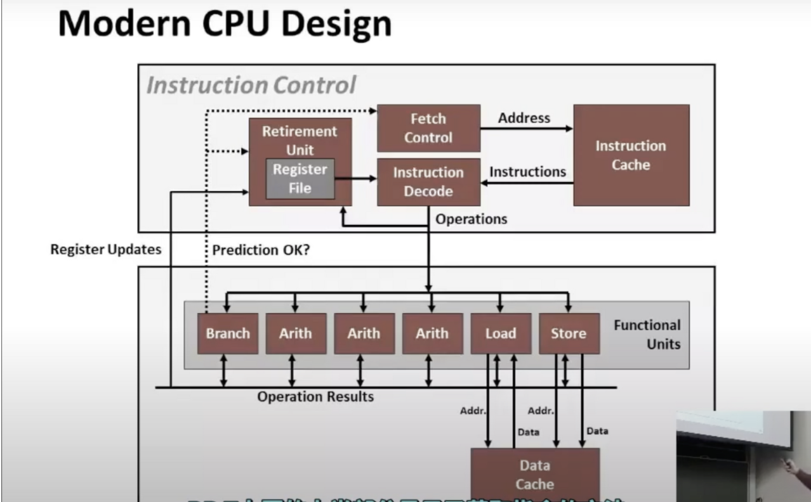

在一个语言中实现数组的典型方法是，使用一个数据结构，不仅保存数组中的值，还保存与其相关的其他信息，比如它的大小

通常当你编写代码遍历处理一个数组时，会使用处理器内部时钟的时钟周期作为时间单位

CPU设计

一个程序，计算机会读入一条指令，然后执行这条指令

CPU采用了一种叫做超标量乱序执行的技术，你可以认为你的程序是一个顺序执行的指令序列，CPU尽可能多地读取多的指令序列，然后CPU把读入的指令拆开，发现有的指令之间不是相互依赖的，所以我可以开始执行程序后面的代码，这被称为**指令级并行性**。

上半部分，有**高性能本地缓存**，缓存会把指令送入**指令译码**这个硬件中，这个硬件把指令拆分为**低级操作**，并确定这些操作之间的依赖关系，CPU还有一组**功能单元**，能够执行这些低级操作，如算术浮点运算，从内存中读取数据，写入数据到内存，所有的操作都使用缓存

总的来说，基本思想就是把你程序的操作进行拆分，重组，使这些基本单元尽可能保持繁忙。执行代码的不同片段，与以前不同的顺序执行不同的指令。**一组寄存器可以看作是可读可写的一段内存**，一个寄存器相当于一个内存符号，一条指令往内存写，其他一些指令读取这个内存。寄存器是一条指令产生数据的目的地，也是一些其他指令的数据来源，有很多数据通过寄存器进行传递

功能单元使用了流水线技术，流水线的思想是将计算分解成一系列不同的阶段