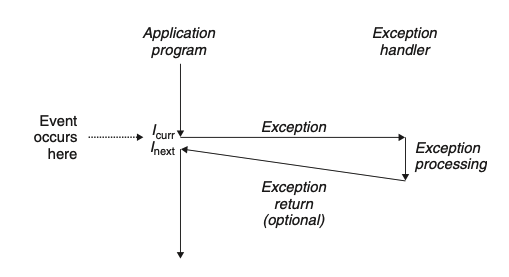

# 8.1 Exceptions
异常控制流的实现包括硬件和操作系统两个部分 不同硬件实现不一样，但整体思路是一样的 本节我们介绍具体原理

异常发生可能与当前指令有关，比如， divide by zero / page fault 错误等；也可能和当前指令无关，比如 system timer goes off
其处理方式都是一样的，我们会发起一个 indirect procedure call 通过 exception table 调用到 exception handler （操作系统提供）
当异常处理结束后，可能发生下面三种情况：
1. handler 返回当前指令
2. handler 返回下一条指令
3. handler 结束当前程序