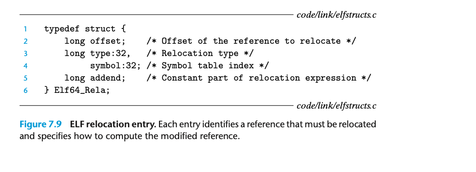

## 7.7.1 Relocation Entries

在生成目标模块时，汇编器不知道代码和数据最终将存储在内存的哪个位置。它也不知道模块引用的任何外部定义的函数或全局变量的位置。因此，当汇编器遇到一个最终位置未知的对象引用时，它会生成一个重定位项，告诉链接器在将目标文件合并到可执行文件时如何修改引用。代码的重定位项放置在.rel.text中，数据的重定位项放置在.rel.data中。

ELF定义了32种不同的重定位类型，其中许多相当复杂。我们只关注最基本的两种重定位类型：

R_X86_64_PC32：对使用32位PC相对地址的引用进行重定位。PC相对地址是相对于当前程序计数器（PC）的偏移量。当CPU使用PC相对寻址执行指令时（例如调用指令的目标），它将32位值编码在指令中，加到当前运行时PC的值上，该PC始终是内存中下一条指令的地址。

R_X86_64_32：对使用32位绝对地址的引用进行重定位。绝对寻址时，CPU直接使用指令中编码的32位值作为有效地址，无需进一步修改。