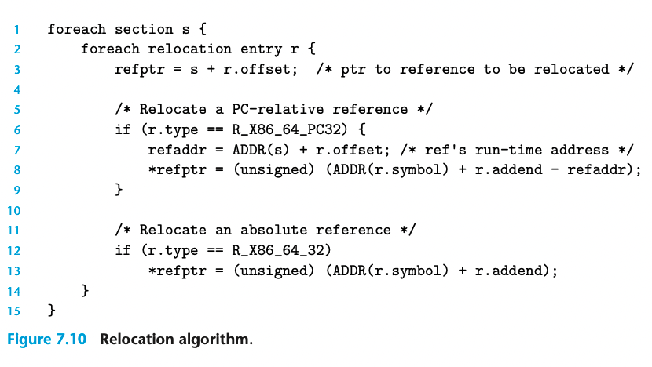
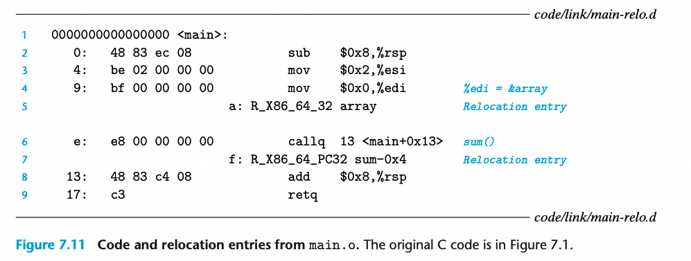

## 7.7.2 Relocating Symbol References

这是 relocate 过程的伪代码；根据两种不同的 reference 类型，分别计算 runtime address
下面来看个 relocate PC-relative 的例子

main 函数有两个全局变量引用 array 和 sum
line 6 的 relocation entry
r.offset = 0xf
r.symbol = sum  
r.type   = R_X86_64_PC32  
r.addend = -4  
若  ADDR(s) = ADDR(.text) = 0x4004d0 且 ADDR(r.symbol) = ADDR(sum) = 0x4004e8
则 refaddr = ADDR(s)  + r.offset = 0x4004d0 + 0xf = 0x4004df
然后修改 *refptr = (unsigned) (ADDR(r.symbol) + r.addend - refaddr)
绝对重定位比较简单 不展开