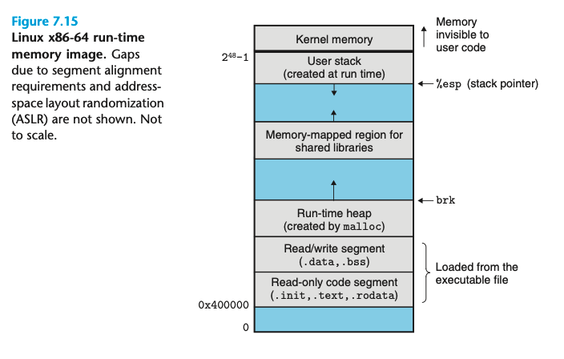

# 7.9 Loading Executable Object Files
`linux> ./prog` 运行程序的办法；shell 会假设 prog 是一个可执行文件，通过 loader 来装载他
loader 会从磁盘拷贝代码和数据到内存，并跳转到其第一个指令或者 entry point

每个程序都有一个类似上图的运行时内存镜像；在 x86-64 系统中， 代码区从 0x400000 开始，然后是数据区
heap 在数据区之后，并随着调用 malloc 而增长； 再之后是保留的 shared library 的区域； stack 从最大的用户地址开始往下增长； 从 $$2^{48}$$ 开始。
> there is a gap between the code and data segments due to the alignment requirement on the .data segment  