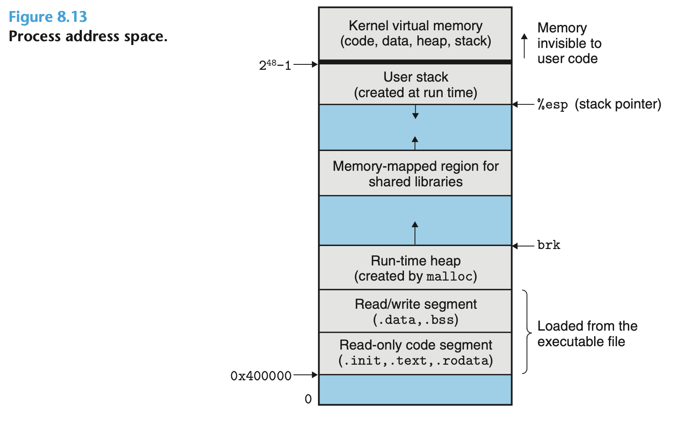

## 8.2.3 Private Address Space
每个进程看起来都像独占着系统的地址空间；每个进程都有自己的 private address space； 其他进程一般访问不到当前进程的私有地址
地址空间的布局是相似的

## 8.2.4 User and Kernel Modes
处理器一般提供一个 mode bit 标识当前程序运行在 kernel mode 与否
在用户态，进程是不允许执行一些 privileged instructions 的，比如暂停进程，发起 IO 操作；也不能访问内核态的地址空间；这些操作必须通过系统调用完成
Linux 还提供了一种 /proc filesystem ； 允许用户态进程访问一些 kernel data structures