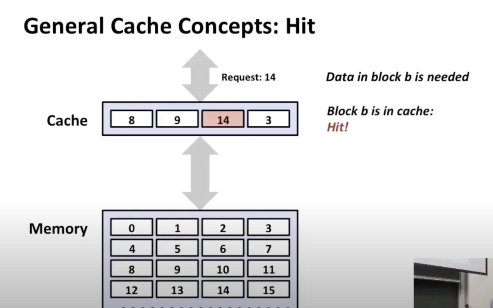

缓存的一般工作方式：

在各种缓存中都有某种传输单元，这就是接近存储器层次结构上层的工作过方式

内存被分成一个个的块，每个块的字节数相同，数据以**块大小为传输单位**在**内存和高速缓存之间传输**

缓存中有数据，然后给CPU使用（缓存命中）

从内存对应数据的块拿数据，放到缓存中，然后给CPU使用（缓存不命中的情况）

区分几种缓存不命中的种类：

1.冷不命中（强制不命中） 其实就是上面那种情况

2.容量不命中（缓存容量不够用）

我们将一些不断被程序访问的块称为工作集

