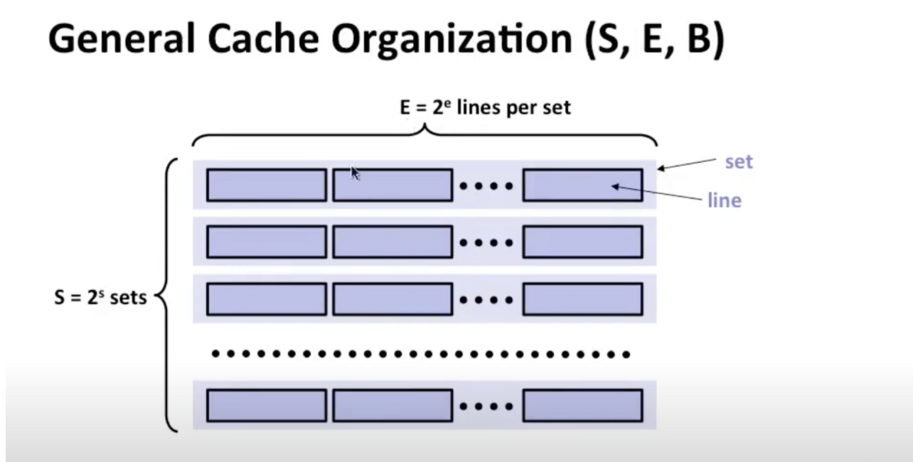

高速缓存存储器

完全由硬件控制，使用快速SRAM存储器实现的

这里的关键是，硬件逻辑得知道，**如何查找**缓存中的块，并确定**是否包含特定块**

所有缓存寄存器都按以下方式组织：

可以将缓存视为由S=2^s个【组】构成，每一【组】包含E=2^e【行】，每一行由一个B=2^b字节的数据块组成

存在一个有效位【v】，指示这些数据位和数据块实际上是存在的

附加位【tag】，将帮助我们搜寻块

总缓存大小：C=S*E*B