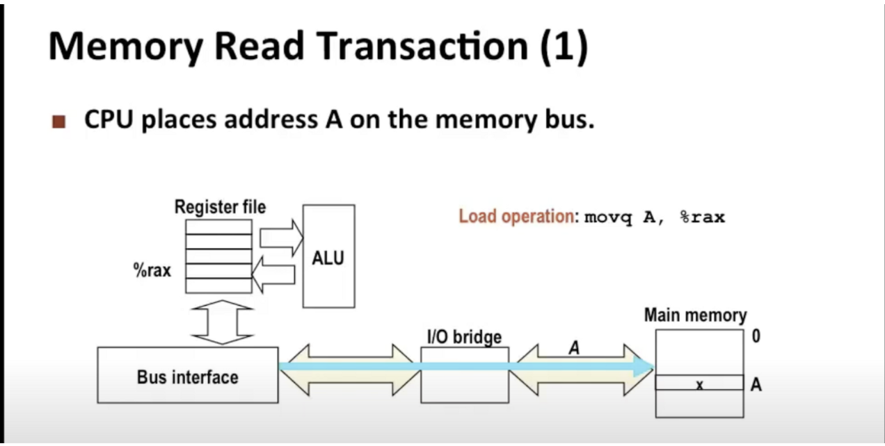

现在大多数人所熟悉的内存其实叫做随机访问存储器(RAM)

RAM根据**存储单元的实现方式**可以分为2种：

1.SRAM

需要4-6个晶体管

用于内存容量小但速度非常快的芯片中，叫做高速缓存

2.DRAM

只需要一个晶体管去存储1bit

广泛应用于主存，以及显卡中的帧缓存中

SRAM快一个数量级

有另外一种存储器，称为非易失性存储器，即使断电的情况下也可以保存其中的内容，被称为只读存储器（ROM），现在被称为闪存。开启电脑的时候的BIOS、开机后执行的最初的指令、都存储在ROM中

主存是通过一些电子线路连接到CPU上的，这被称为主线（bus）

**数据流**就可以从内存和CPU芯片之间来回传输

CPU芯片中有一些寄存器，有一个算计逻辑单元会从寄存器文件读写数据，然后对数据进行一点的算术运算和逻辑运算

CPU执行movq指令的过程

