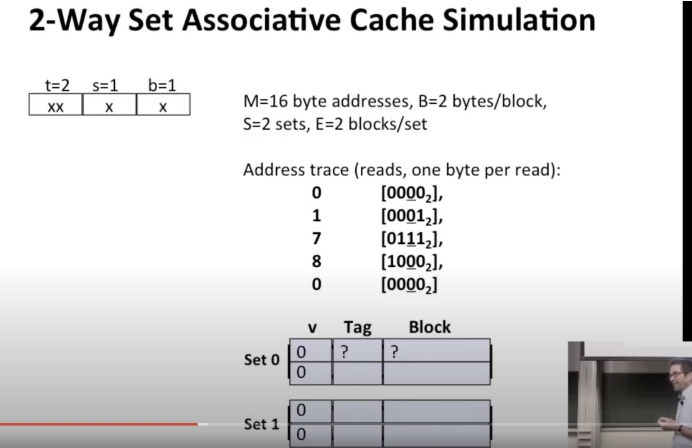

一旦我们确定匹配，我们就检查组偏移位

在这种情况下，我们正在访问一个短整型，因此4是该区块内的偏移量，但这次使用了2路组相连，内存系统是一样的

最常用的算法是【最近最少使用】策略

根据局部性原则，你希望将缓存中的块将尽可能多次地使用，逆着局部性原则来思考，如果一个块长时间不被引用，在不久的将来，它也不太可能会被引用，你只是跟踪，我没有说那里需要额外的位，类似的排序中，保持虚拟时间戳，只是尽量保持最常访问的块