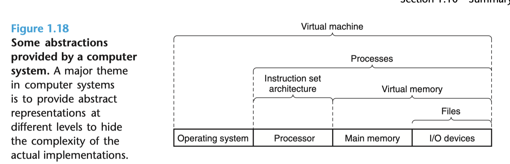

# CSAPP 读书笔记 day4

阅读页数：P61-P65

## 第一章： 计算机系统漫游

### 1.9 重要的主题

#### 并行和并发

我们使用术语并发性来指代具有多个同时活动的系统的一般概念，并使用术语并行性来指代使用并发性使系统运行得更快。

- 线程级别的并行
- 指令集级别的并行
- SIMD并行：在最低级别，许多现代处理器具有特殊的硬件，允许 单个指令导致并行执行多个操作，一个 称为单指令、多数据 （SIMD） 并行性的模式。

#### 抽象的重要性

