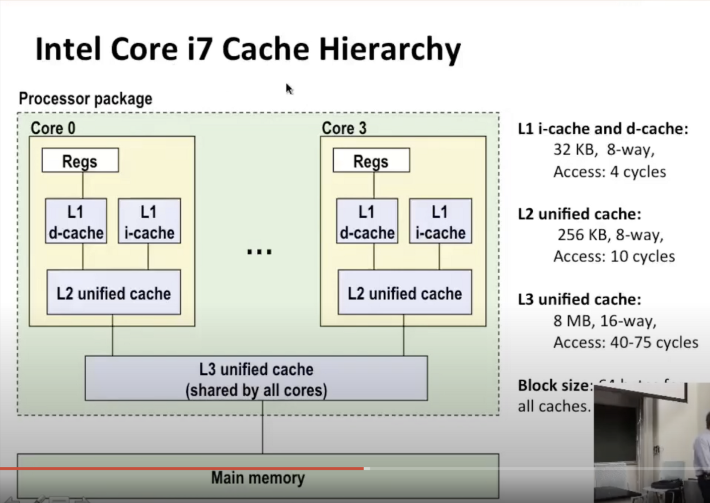

这里有一个**写操作**，如果我们有一个**正确的缓存没有命中**，看看会发生什么，我们写的字，**不包含在缓存中的任何块中**，我们有2个选项，我们可以叫做**【写分配】**。如果有一个缓存未命中，那么就能处理了，如果**缓存命中**了，我们可以做一些**对称**的事情，一个新行可能会覆盖现有的行，然后写入，以便我们可以创建该缓存，进入该缓存行，从内存中获取它，然后执行写操作，这对于那时的读取来说是对称的，因此每一次写未命中，那个块将会在缓存中，如果我们进行后续读操作，就会有缓存命中。

**【非写分配】**不要分配新行，直接将数据写入内存。如果发生了缓存命中，我们直到最后时刻才将其写回磁盘，每次有写未命中，都会在缓存中创建一个新条目

