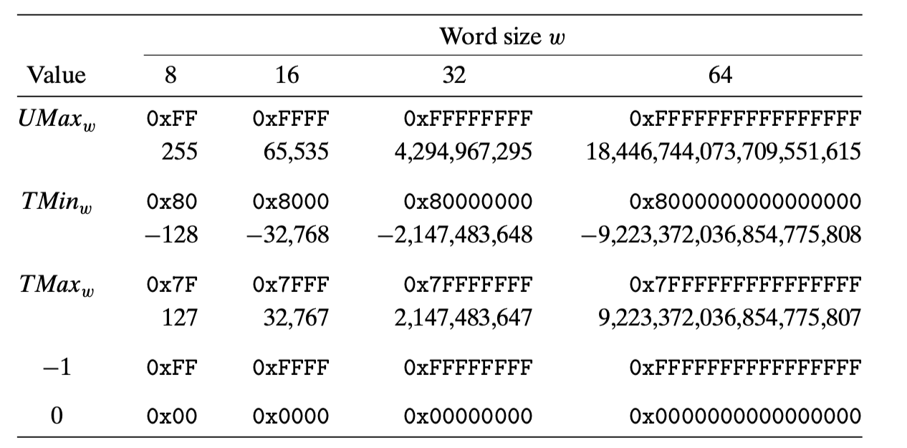

# CSAPP 读书笔记

阅读页数：P101 - P105

## 第二章： Representing and Manipulating Information

2.17 做题

$$
\begin{array}{cccc}
{\vec{x}} & & \\
\hline \text { Hexadecimal } & \text { Binary } & B 2 U_{4}(\vec{x}) & B 2 T_{4}(\vec{x}) \\
\hline \text { 0xA } & {[1010]} & 2^{3}+2^{1}=10 & -2^{3}+2^{1}=-6 \\
\text { 0x1 } &[0001] & 2^0=1&2^0=1\\
\text { 0xB } &[1011] & 2^3+2^1+2^0=11 & -2^3+2^1+2^0=-5 \\
\text { 0x2 } & [0010] & 2^1=2&2^1=2\\
\text { 0x7 } &[0111] &2^2+2^1+2^0=7&2^2+2^1+2^0=7 \\
\text { 0xC } & [1100]&2^3+2^2=12&-2^3+2^2=-4
\end{array}
$$

重要的数

$$

$$
