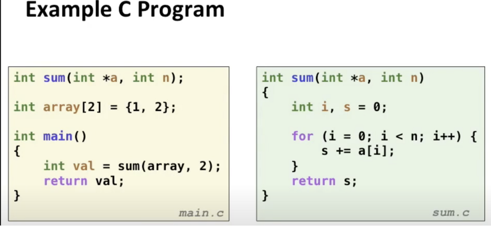
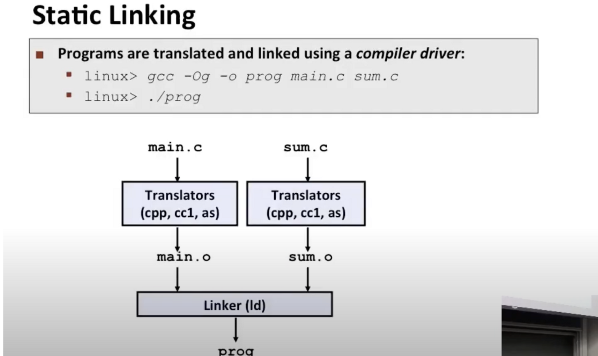

静态编译

对于每个main.c和sum.c，GCC会在这些模块上调用.c文件上的一系列翻译器

首先调用c**预处理器**cpp（将main.c翻译成main.i）

然后他们调用**编译器**，实际上使用的编译器叫cc1（将mian.i翻译成ASCII汇编语言文件main.s）

编译器生成汇编程序，然后**汇编器**将其翻译，结果生成了一个.o文件

最后**连接器**拿到2个.o文件，然后放一些（必要的系统目标文件），将他们链接在一起，创建一个单个的可执行文件，然后运行