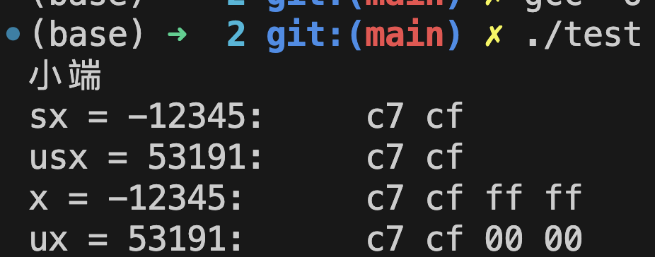

# CSAPP读书笔记

## C语言中的有符号和无符号

当执行一个运算时，如果它的一个运算数是有符号而另一个是无符号，C语言会隐式地将有符号参数强制转换成无符号数，并假设两个数都是非负数。

## 扩展一个数字的位

当用更多的内存存储某一个有符号数时，由于符号位位于该数的第一位，扩展之后，符号位仍然需要位于第一位，所以，当扩展一个负数的时候需要将扩展的高位全赋为1；对于正数而言，符号扩展和零扩展是一样的，因为符号位就是0。

无符号数的零扩展：设  $\mathrm{u}_{\mathrm{w}}=\left[\mathrm{u}_{\mathrm{w}-1}, \ldots, \mathrm{u} 1, \mathrm{u}_{0}\right], \mathrm{w}^{\prime}>\mathrm{w} $，  扩展后  $\mathrm{u}_{\mathrm{w}^{\prime}}=\left[\mathrm{u}_{\mathrm{w}^{\prime}-1}, \ldots, \mathrm{u}_{\mathrm{w}}, \mathrm{u}_{\mathrm{w}-1}, \ldots, \mathrm{u}_{0}\right] $ ，其中  $\mathrm{u}_{\mathrm{w}^{\prime}-1}=\mathrm{u}_{\mathrm{w}^{\prime}-2}=\ldots=\mathrm{u}_{\mathrm{w}}=0$  。 由计算可知 $ \mathrm{B} 2 \mathrm{U}_{\mathrm{w}}\left(\mathrm{u}_{\mathrm{w}}\right)=\mathrm{B} 2 \mathrm{U}_{\mathrm{w}^{\prime}}\left(\mathrm{u}_{\mathrm{w}^{\prime}}\right)  $。

有符号数的符号扩展：设 $ \mathrm{x}_{\mathrm{w}}=\left[\mathrm{x}_{\mathrm{w}-1}, \ldots, \mathrm{x}_{1}, \mathrm{x}_{0}\right], \mathrm{w}^{\prime}>\mathrm{w} $ ，扩展后  $\mathrm{x}_{\mathrm{w}^{\prime}}=\left[\mathrm{x}_{\mathrm{w}^{\prime}-1}, \ldots, \mathrm{x}_{\mathrm{w}}, \mathrm{x}_{\mathrm{w}-1}, \ldots, \mathrm{x}_{0}\right]  ，其中  \mathrm{x}_{\mathrm{w}^{\prime}-1}=\mathrm{x}_{\mathrm{w}^{\prime}-2}=\ldots=\mathrm{x}_{\mathrm{w}}=   \mathrm{x}_{\mathrm{w}-1}  。$由计算可得$  \mathrm{B} 2 \mathrm{~T}_{\mathrm{w}}\left(\mathrm{x}_{\mathrm{w}}\right)=\mathrm{B} 2 \mathrm{~T}_{\mathrm{w}^{\prime}}\left(\mathrm{x}_{\mathrm{w}^{\prime}}\right) $。

书上的程序：

```c
#include<stdio.h>
typedef unsigned char *byte_pointer;

void show_bytes(byte_pointer start, size_t len) {
    size_t i;
    for (i = 0; i < len; i++)
	printf(" %.2x", start[i]);    //line:data:show_bytes_printf
    printf("\n");
}

void show_int(int x) {
    show_bytes((byte_pointer) &x, sizeof(int)); //line:data:show_bytes_amp1
}

void show_float(float x) {
    show_bytes((byte_pointer) &x, sizeof(float)); //line:data:show_bytes_amp2
}

void show_pointer(void *x) {
    show_bytes((byte_pointer) &x, sizeof(void *)); //line:data:show_bytes_amp3
}
int test1_endian() {
    int i = 1;
    char *a = (char *)&i;
    if (*a == 1)
         printf("小端\n");
    else
         printf("大端\n");
    return 0;
}
int main(int argc, char const *argv[])
{
    test1_endian();
    short sx=-12345;
    unsigned short usx=sx;
    int x=sx;
    unsigned ux=usx;
    printf("sx = %d:\t",sx);
    show_bytes((byte_pointer)&sx,sizeof(short));
  
    printf("usx = %u:\t",usx);
    show_bytes((byte_pointer)&usx,sizeof(unsigned short));

    printf("x = %d:\t",x);
    show_bytes((byte_pointer)&x,sizeof(int));
   

    printf("ux = %u:\t",ux);
    show_bytes((byte_pointer)&ux,sizeof(unsigned));
    return 0;
}

```

结果：（本地小端）


