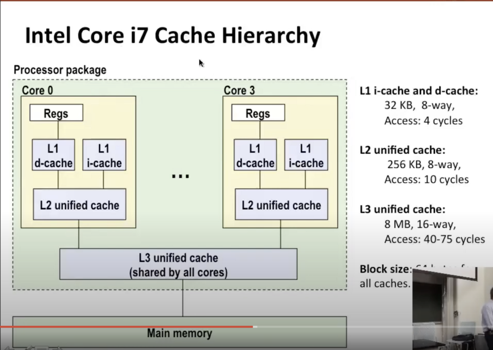

这些处理器内核可以各自并行执行他们自己的独立指令流，每个处理器内核可以包含通用寄存器，其在高速缓存层次结构中为0级，然后是2种不同的L1缓存，而【i-cache】是指令缓存，这些是相当小的32k字节，它们是8路组相关，并且可以在极少的时钟周期内访问它们，层次结构的下一级是【L2缓存】，这仍然是相当小的256k字节，相同的关联性，它的访问时间稍长一些，在L2缓存包含数据和指令的意义上，它是统一的，这一切都在芯片的单核心内，然后在芯片上，但在所有内核外部，并由所有内核共享的，是【L3统一缓存】，其大小8m和16路组相联，如果在L1未命中，则L1感知到，然后尝试向L2发送请求以尝试在L2中查找数据，由于L2稍微大一点，由或许数据还没有从L2中刷新，如果L2无法找到他，它会向L3发送请求，以查看它们是否能够在L3中找到数据

